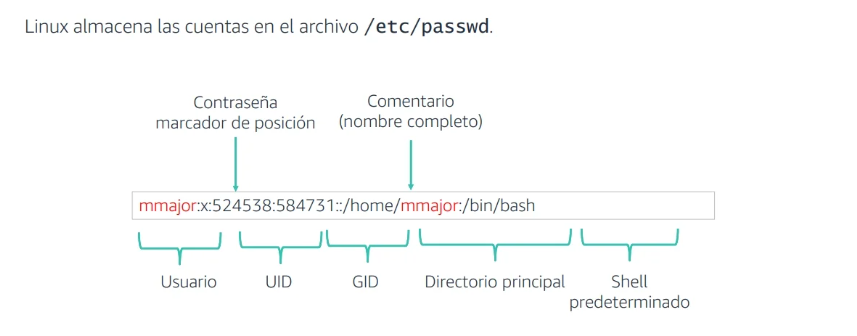
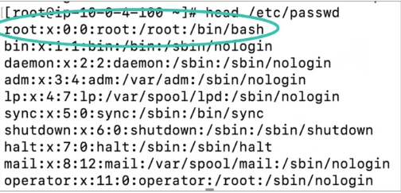

# Administracion de usuarios

## Cuentas de usuario

- Las cuentas de usuario representan a los usuarios en el sistema.
- La información del usuario puede almacenarse a nivel local o en otro servidor accesible a través de una red.
- Cuando la información se almacena a nivel local, Linux la almacena en el archivo /etc/passwd.
- La práctica recomendada consiste en asignar un usuario por cuenta.
- Las cuentas no deben compartirse.

## tail

```bash
[username@hostname ~]$ tail
```

tail es un comando que muestra las últimas líneas de un archivo. De forma predeterminada, muestra las últimas 10 líneas,
pero puede modificar el número de líneas con la opción –n.

Por ejemplo, el siguiente comando muestra las cinco últimas líneas:

```bash
[username@hostname ~]$ tail –n 5 /etc/passwd
```

El cual permite ver las ultimas 5 lineas del archivo /etc/passwd donde se guardan los usuarios.

## El archivo /etc/passwd

Linux almacena las cuentas en el archivo /etc/passwd.


El archivo passwd contiene usuarios registrados en el sistema.
Tiene el formato de un archivo separado por dos puntos que contiene la siguiente información:

- Nombre de usuario
- Contraseña cifrada
- ID de usuario
- ID de grupo del usuario
- Nombre completo del usuario
- Directorio principal del usuario
- El shell que se utiliza después de iniciar sesión

## Cuentas de usuario predeterminadas

- Las cuentas de sistema predeterminadas se crean durante la instalación de Linux y los servicios.
- Por ejemplo, se crea una cuenta de usuario raíz durante la instalación, lo que permite administrar el sistema.



## Comando head

head es el comando complementario de tail. Muestra las 10 primeras líneas de un archivo de forma predeterminada.  
Puede modificar la cantidad de líneas con la opción –n:  
Por ejemplo, el siguiente comando muestra las cinco primeras líneas:

```bash
[username@hostname ~]$ head –n 5 /etc/passwd
```
