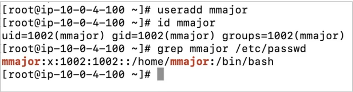
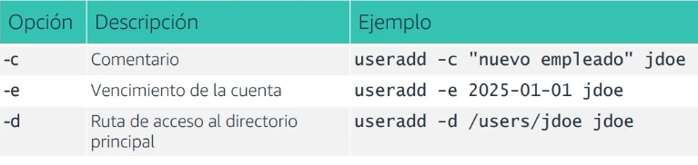
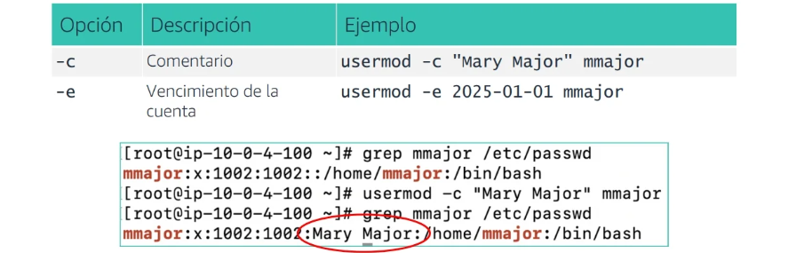
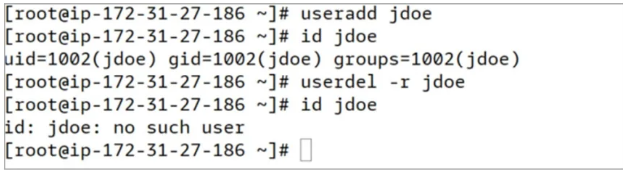
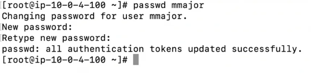

# Agregando Usuarios

## El comando useradd

- Crea la cuenta de usuario.
- Crea un directorio principal para el usuario en /home.
- Define los valores predeterminados de la cuenta



## Comando grep

grep es un comando que busca una cadena en un archivo.  
Por ejemplo, el siguiente comando muestra todas las apariciones de la cadena mmajor en el archivo /etc/passwd:

```bash
[username@hostname ~]$ grep mmajor /etc/passwd
```

## Las opciones del comando useradd

- Las opciones permiten personalizar la cuenta de usuario en el momento de la creación.
- El campo de comentarios se utiliza a menudo para colocar el nombre completo del usuario.



## El comando usermod

Este comando se utiliza para modificar o cambiar una cuenta de usuario existente, en parte o en su totalidad



## El comando userdel

- Elimina una cuenta de usuario.
- Utiliza la opción -r para borrar también el directorio principal del usuario.



## El comando passwd

- Las contraseñas de usuario se establecen con el comando passwd.
- Debe ingresar la contraseña dos veces.
- Los usuarios pueden restablecer sus propias contraseñas y el usuario raíz puede restablecer cualquier contraseña de
  usuario.
- No se muestra ningún carácter en la pantalla cuando se establece la contraseña.


