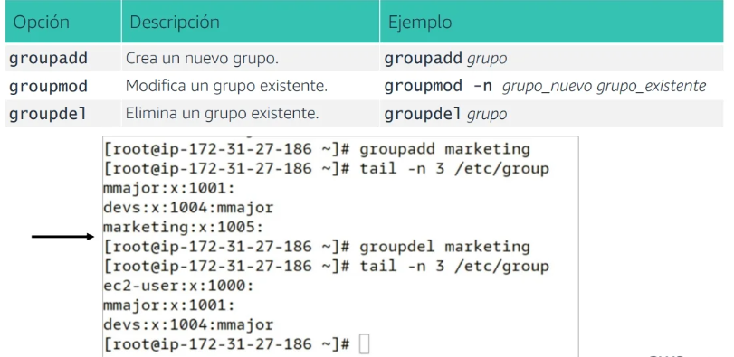
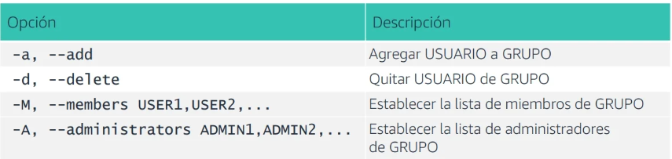

# ¿Qué son los grupos?

- Un grupo es un conjunto de cuentas.
- Los grupos son una forma cómoda de asociar cuentas de usuario con necesidades de seguridad similares.
- Por ejemplo, es más fácil conceder permisos a un grupo de cuatro usuarios que conceder permisos individualmente a cada
  uno de los cuatro usuarios de forma individual.
- La ubicación de almacenamiento de los grupos es el archivo /etc/group.

## Los comandos groupadd, groupmod y groupdel

## Agregar un usuario a un grupo

- Agregar un usuario a un grupo es una modificación de un usuario, no de un grupo.
- Para agregar un usuario a un grupo, puede utilizar:
- El comando usermod
- El comando gpasswd

## El comando gpassword

- Se utiliza para administrar el archivo /etc/group
- Uso: gpasswd [opción] GRUPO

