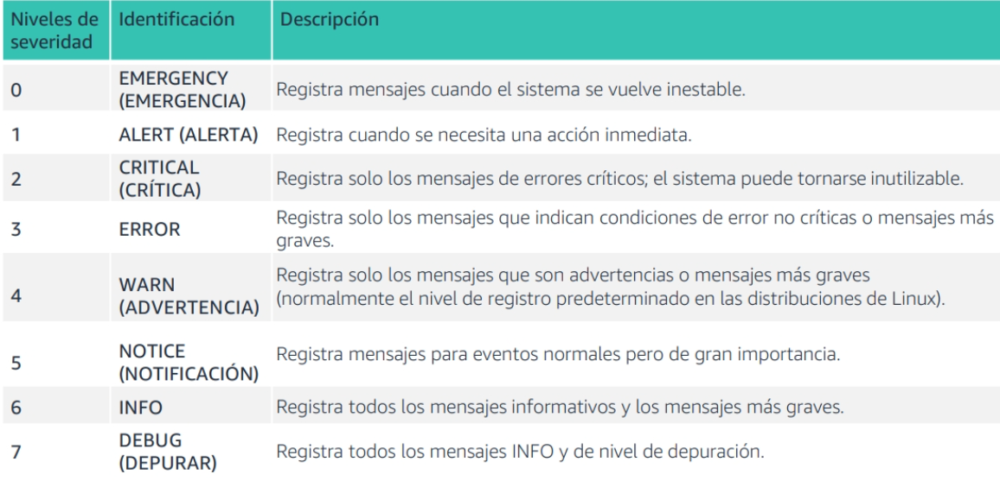
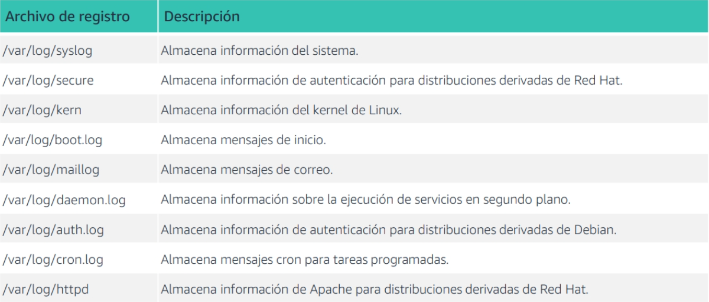

# Administrado de archivos de registro

¿ Que son los registros?
Los registros mantienen registros de los eventos en el sistema , lo que ayuda a realizar auditorias

Tipos de registros:

- Registros del sistema(informacion de inicio del sistema y tiempos de apagado del sistema)
- Registros de eventos (eventos de inicio de sesion y cierre de sesion del usuario)
- Registro de aplicaciones (tiempo de inicio, acciones y errores)
- Registros de servicio

## La importancia del registro

El registro puede ayudar a solucionar porblemas: ¿Que o quien provoco un error? ¿Alguien ha accedido erroneamente a un
archivo , una base de datos o un servidor?

Los registros son importantes para las auditorias de seguridad(recopilacion de informacion sobre el sistema) y los
acuerdos de nivel de servicio (la solucion de problemas debe comenzar en un lazo de x horas despues de ocurrido un
problema)

## Niveles de registro



## Archivos de registro importantes



## El comando lastlog

Brinda informacion sobre inicios de sesion recientes del sistema.  
Puede informar de todos los inicios de sesion o solo de los inicios de sesion de un usuario especifico.

```bash
[username@hostname ~]$ lastlog
```

El comando lastlog recupera informacion del usuario del archivo /var/log/lastlog y la genera en la consola.
