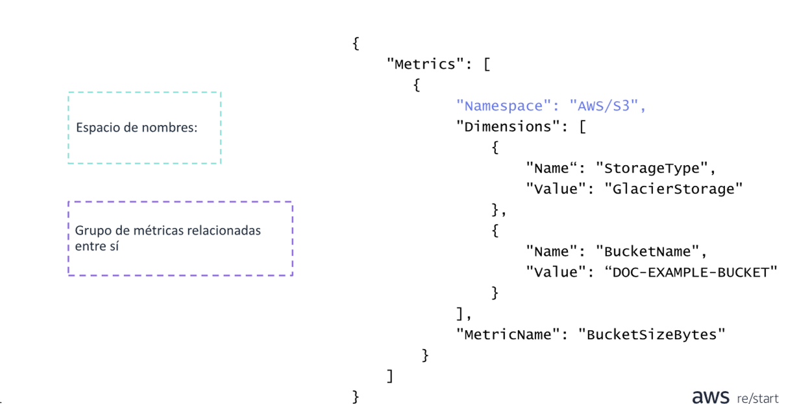

# Amazon CloudWatch

La funcion principal de Amazon CloudWatch es para monitorear el rendimiento y el estado de sus recursos y aplicaciones
de AWS. También puede utilizar CloudWatch para recopilar y monitorear los archivos de registro de sus instancias EC2,
AWS cloudTRail, Amazon Route 53 y otras fuentes.

Amazon CloudWatch es un sistema de recopilacion de estadísticas distribuido.  
Recopila y hace un seguimiento de las metricas desde sus aplicaciones. También puede crear y usar sus propias metricas
personalizadas y recibir notificaciones cuando se activa una alarma.

CloudWatch tiene dos opciones diferentes de monitoreo:

* **Monitoreo basico para instancias de Amazon EC2:** siete metricas preseleccionadas con una frecuencia de 5 minutos y
  3 metricas de comprobación de estado con una frecuencia de 1 minuto, sin cargo adicional.
* **Monitoreo detallado para instancias de amazon EC2:** todas las metricas que estad disponibles para el monitoreo
  basico con una frecuencia de un minuto, por un costo adicional. Las instancias con monitoreo detallado habilitado
  proporcionan agregación de datos por Amazon EC2, ID de Amazon Machine image (AMI) y tipo de instancia

CloudWatch conserva las metricas durante 15 meses sin cargo. Las metricas de CloudWatch son compatibles con los
siguientes tres cronogramas de retención:

* Los puntos de datos de 1 minuto están disponibles durante 15 días.
* Los puntos de datos de 5 minutos están disponibles durante 63 días.
* Los puntos de datos de 1 hora, están disponibles durante 455 días.

### Ejemplos de utilizacion

### Acciones de Amazon CloudWatch

## Alarmas de Amazon CloudWatch

Puede crear una alarma de cloudwatch que supervise una sola métrica de CloudWatch o el resultado de una expresion
matemática que se basa en varias métricas de CloudWatch. La alarma realiza una o varias acciones según el valor de la
métrica o expresión con respecto a un umbral durante varios periodos.

Una alarma tiene tres estados posibles:

* OK: La métrica está dentro del umbral definido.
* ALARM: la métrica está fuera del umbral definido.
* INSUFFICIENT_DATA: la alarma acaba de iniciarse, la métrica no está disponible o no hay suficientes datos disponibles
  en la métrica para determinar el estado de la alarma.

### Ejemplo de monitoreo de CloudWatch

## Ejemplo puntual de alarmas de CloudWatch

En el diagrama, el umbral de la alarma de CloudWatch se establece en 3 y la interrupción mínima es de 3 períodos. Eso
significa que la alarma invoca su accíon solo cuando se supera el umbral durante tres periodos consecutivos. En el
diagrama, esta situacion sucede con los periodos tercero a quinto y el estado de la alarma se establece en **ALARM**.
En el periodo seis, el valor cae por debajo del umbral y el estado volverá a ser OK. Más tarde, durante el noveno
periodo, el umbral se supera nuevamente, pero no durante los tres periodos consecutivos necesarios. POr lo tanto, el
estado de la alarma se mantiene en OK.

### Conceptos métricos

### Componentes métricos JSON AWS-CLI

### Métricas

### Monitoreo y seguridad

### Paneles automaticos de CloudWatch

## Resumen CloudWatch

