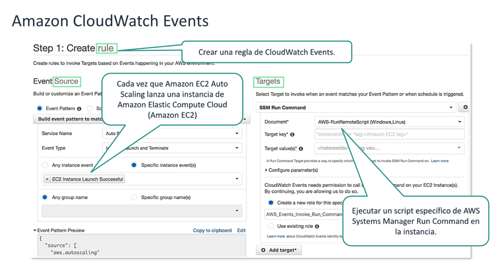
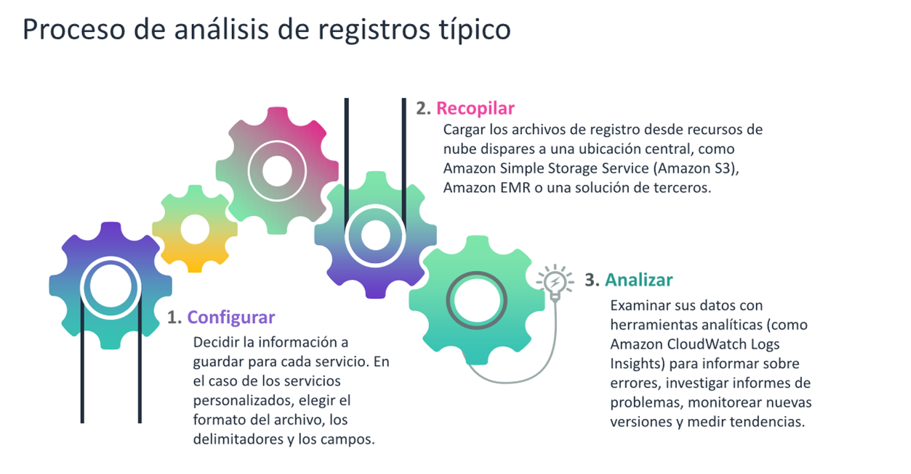
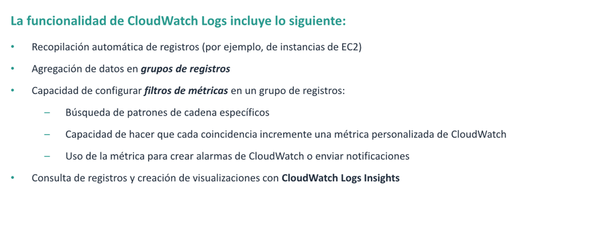
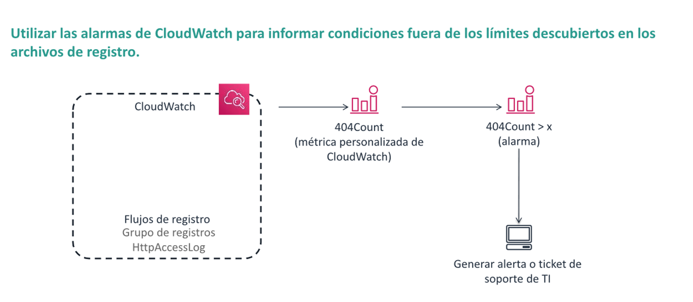
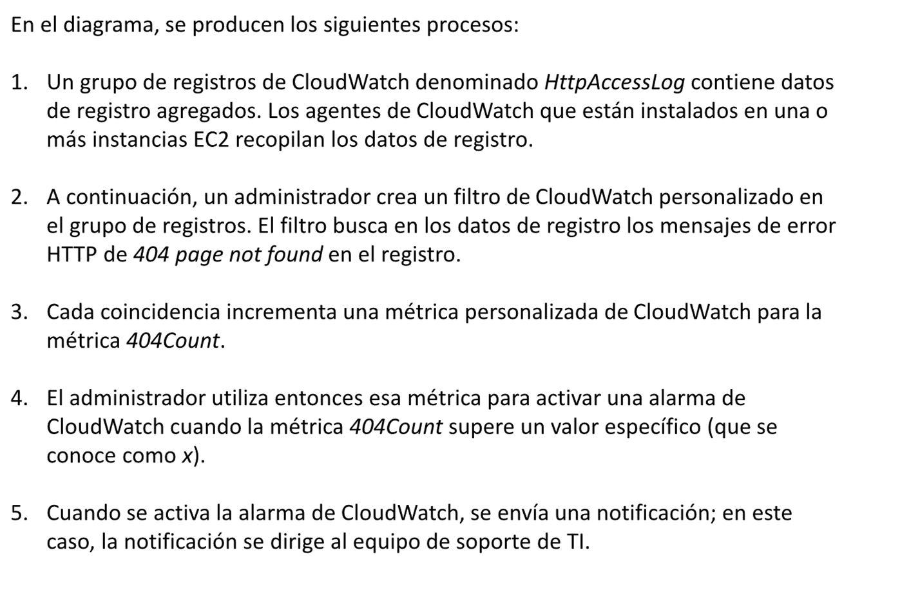
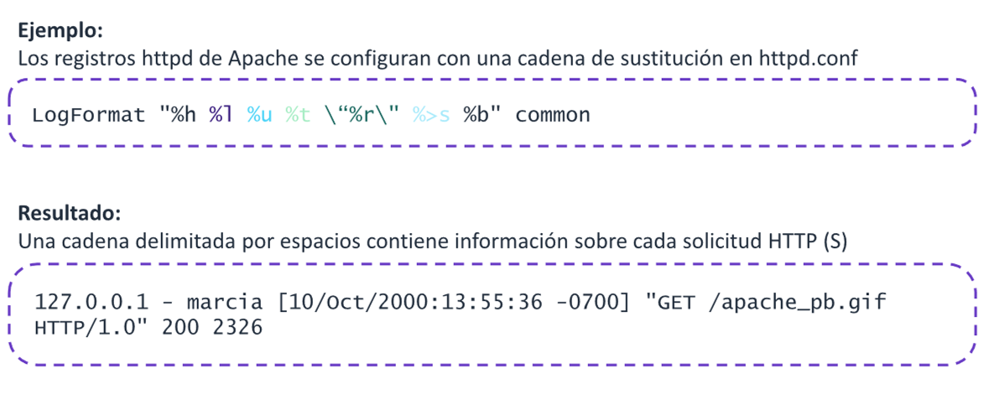
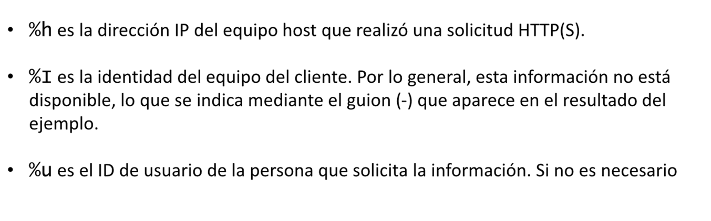
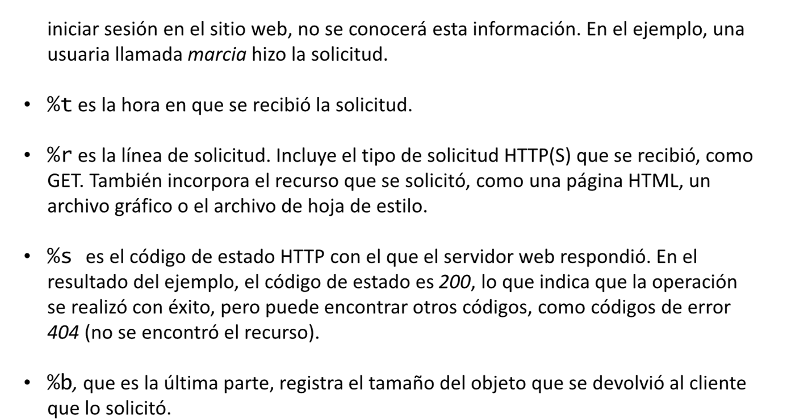
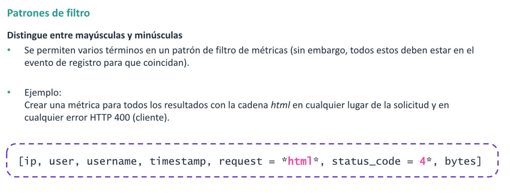
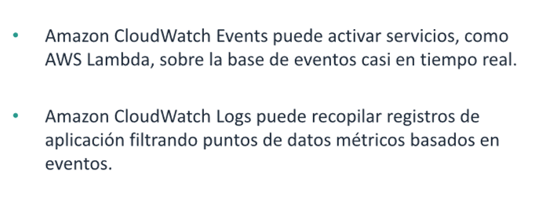

# Profundización: registro y eventos de amazon cloudwatch

Terminos de aprendizaje:

* Describir las caracteristicas de Amazon CloudWatch Events
* Describir las caracteristicas y los beneficios de Amazon CloudWatch Logs

## Amazon CloudWatch Events

Amazon cloudWatch Events proporciona casi en tiempo real un flujo de eventos de sistema que describen cambios en los
recursos de AWS. Mediante reglas sencillas que se pueden configurar, es posible asignar los eventos y dirigirlos a uno
o más flujos o funciones destino. CloudWatch Events toma conciencia de los cambios operativos a medida que se producen.
Responde a estos cambios operativos enviando mensajes, activando funciones, realizando cambios y capturando informacion
de estado.
También puede utilizar CloudWatch Events para programar acciones automatizadas que se activen por su cuenta en
determinados momentos usando expresiones cron o rate.

### Antes de utilizar CloudWatch Events

* **Eventos**: un evento indica un cambio en su entorno de AWS. Los recursos de AWS pueden generar eventos cuando cambia
  su estado. Por ejemplo, Amazon Elastic Compute Cloud (Amazon EC2) genera un evento en el que el estado de una
  instancia EC2 cambia de pending a running. Puede generar eventos personalizados en el nivel de aplicacion y
  publicarlos en CloudWatch Events. También puede configurar eventos programados que se generan de forma periódica.
* **Destinos**: un destino procesa eventos. Los objetivos de ejemplo incluyen instancias EC@, funciones de AWS Lambda,
  temas de Amazon simple notification service y colas de amazon simple Queue service(Amazon SQS).
* **Reglas**: una regla hace coincidir eventos de entrada y los dirige a destino para su procesamiento. Una regla unica
  pueden dirigir a varios destinos, todos los cuales se procesan en paralelo. Esto permite a las distintas partes de una
  organizacion buscar y procesar los eventos que les interesan.

## Amazon CloudWatch Logs

Herramienta para monitorear y almacenar los archivos de registro de sus instancias EC2 , AWS cloudTRail, Amazon Route 53
y otras fuentes ademas de acceder a ellos. A continuacion, puede recuperar los datos de registro asociados de CloudWatch
logs. Puede monitorear registros , casi en tiempo real ,para detectar frases , valores o patrones especificos.

Por ejemplo, puede configurar una alarma sobre la cantidad de errores que se producen en los registros de sistema en una
o mas de sus instancias EC2. Tambien puede ver graficos que visualicen la latencia de las solicitudes web desde los
registros de la aplicacion en sus intancias de EC2. De esta forma , podra consultar los datos del registro inicial para
ver el origen del problema. los datos de registro se pueden almacenar y es posibleacceder a ellos de manera indefinidad,
ademas , se almacenan de manera externa en instancias EC2, por lo que no tendra que preocuparse or llenar los discos
duros.

### Funcionalidad de cloudwatch

## Crear alarmas de CloudWatch en métricas de filtro de registro

## Formato de registros tipicos

Los registros de aplicacion suelen generar datos en un formato estandarizado. Para poder analizar correctamente los
datos relevantes de los archivos de registro, necesita entender el formato de registro.

## Patrones de filtro de amazon CloudWatch

## Resumen

