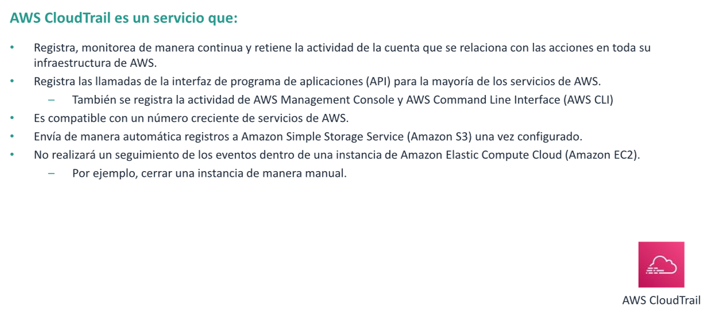
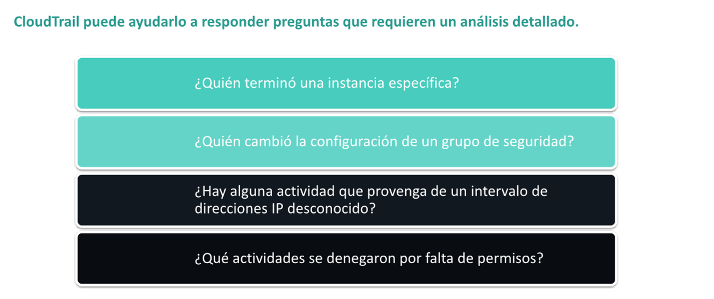
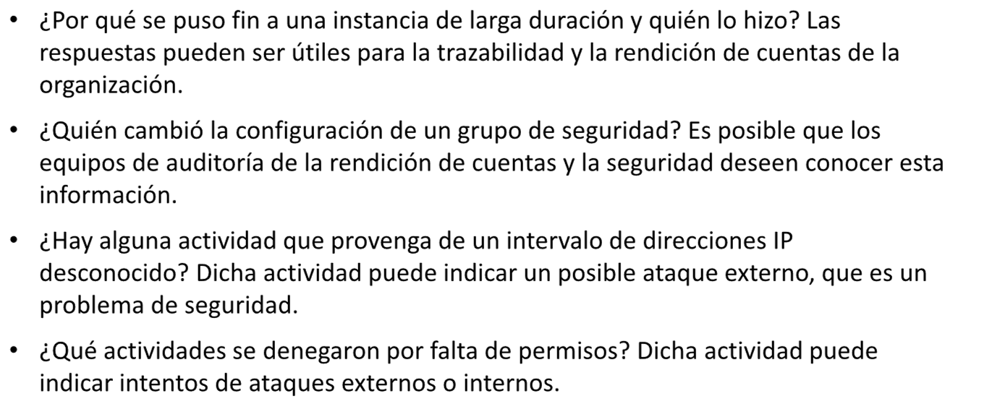
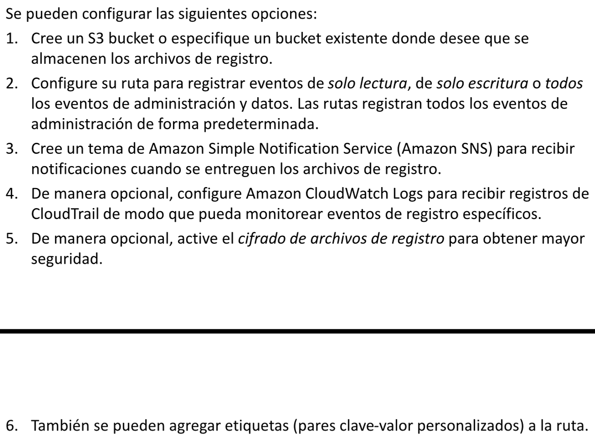
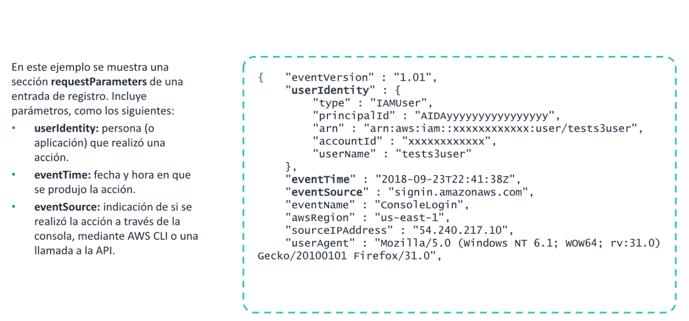
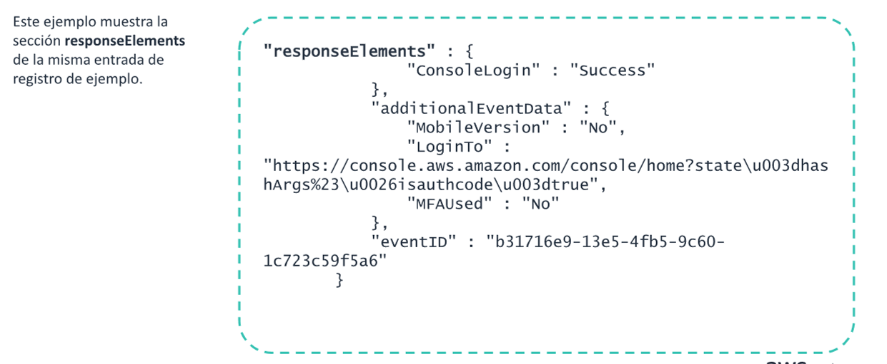
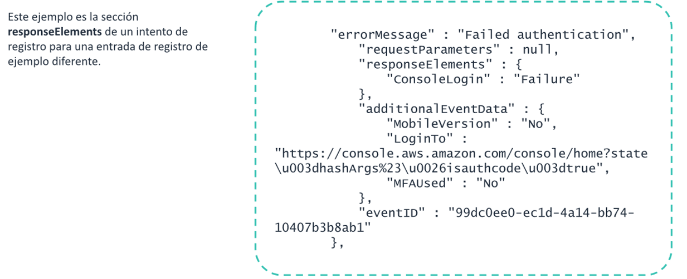
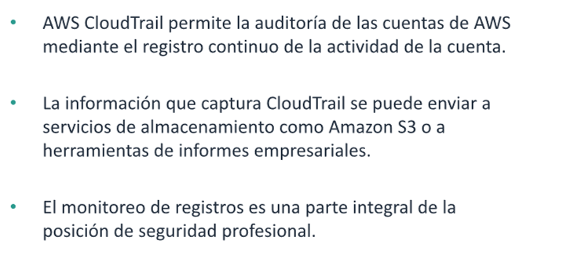

# Amazon CloudTrail


AWS Cloud Trail es un servicio de AWS que genera registros de llamadas a la interfaz de programa de aplicaciones (API)
de AWS. La API de AWS es la base de la AWS Command Line Interface (AWS-CLI) y de la consola de administracion de AWS.
Por lo tanto, CloudTrail puede registrar toda la actividad en relacion con los servicios que monitorea. Permite la
gobernanza, la conformidad, la auditoria de operacion y la auditoria de riesgos de las cuentas AWS.

Es compatible con una gra, cantidad de servicios de AWS.

Una vez configurado CloudTrail, envía los registros de auditoria a Amazon Simple Storage Service(Amazon S3). Aunque AWS
CloudTrail cuenta con todas las caracteristicas, no realiza un seguimiento de los eventos que se producen en una
instancia de Amazon Elastic Compute Cloud (Amazon EC2). Por ejemplo, CloudTrail no actúa un seguimiento de cuando
alguien cierra manualmente una instancia mediante una conexion de sesion de Secure Shell (SSH) a la instancia. Podrían
emitir un comando como

```bash
sudo shutdown -h now
``` 

### Ejemplo de AWS CloudTrail



Con CloudTrail, se puede almacenar registros sobre el uso de API en un S3 Bucket.
Posteriormente, puede analizar esos registros para responder a una serie de preguntas, tales como:



## Configurar un seguimiento

De forma predeterminada, cuando se accede al historial ede eventos de CloudTrail para la region que est viendo,
CloudTrail solo muestra los resultados de los últimos 90 dias. Estos eventos están limitados a eventos de administracion
que creas, modifican y eliminan las llamadas a la API y también de la actividad de la cuenta. Para obtener un registro
completo de la actividad de la cuenta, que incluye todos los eventos de administracion, los eventos de datos y las
actividades de únicamente lectura, debe configurar una ruta de CloudTrail.

Puede crear una ruta mediante el uso de la consola de CloudTrail o de AWS ClI.


## Entrada de registros de AWS CloudTrail: requestParameters



## Entrada de registros de AWS CloudTrail: responseElements (Ejemplo Correcto)



## Entrada de registros de AWS CloudTrail: responseElements (Ejemplo Incorrecto)



## Monitoreo Y seguridad

Cuando usted monitorea la actividad de su cuenta y protege sus recursos y datos, las funciones de CloudWatch y
CloudTrail son complementarias. Utilizar ambos servicios una práctica recomendada. POr ejemplo, puede examinar los
registros de las entradas de Amazon CloudWatch Logs Y AWS CloudTrail para detectar un uso posible no autorizado.  
Otros ejemplos de uso de estos servicios incluyen los siguientes:

* Monitorear los intentos fallidos de inicio de sesion de la consola de administracion de AWS, en especial aquellos que
  provienen de IP sospechosas
* Detener accesos no autorizados a los servicios mendiante a la llamada API
* Identificar un lanzamiento sospechoso de recursos de AWS

## Resumen

