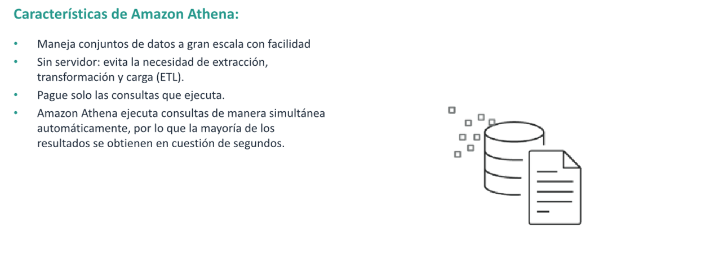
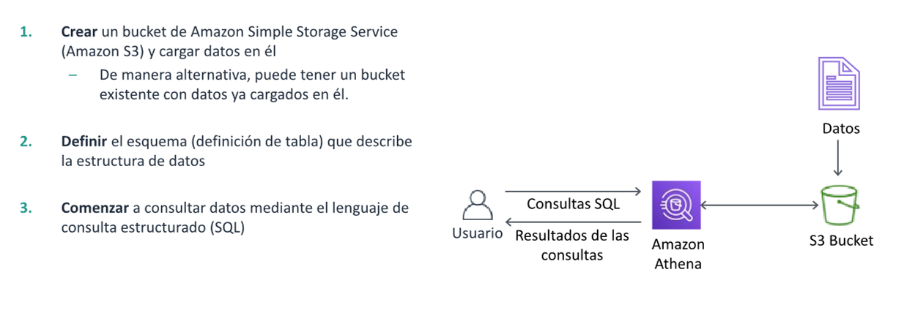
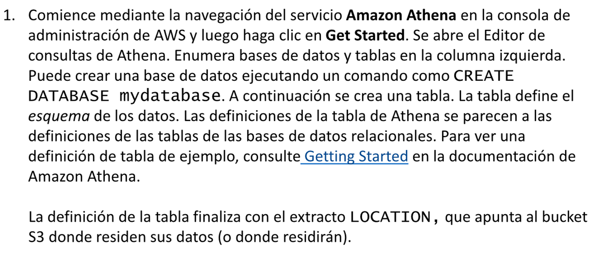
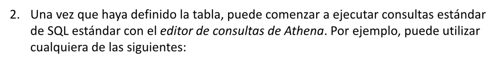
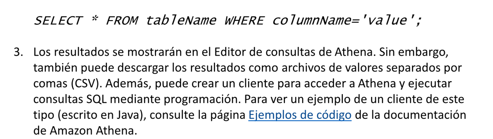
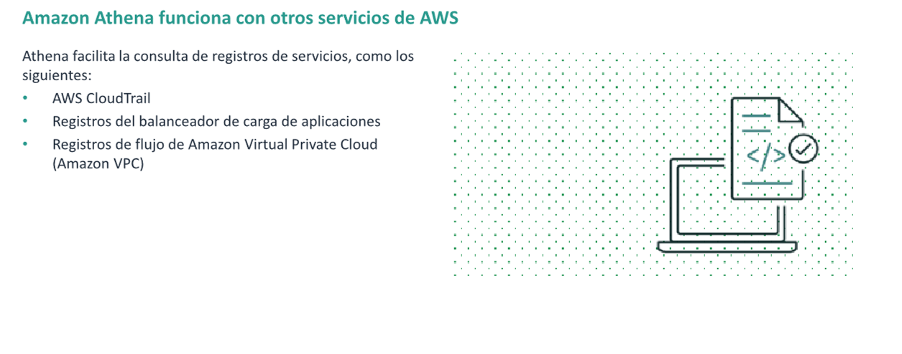
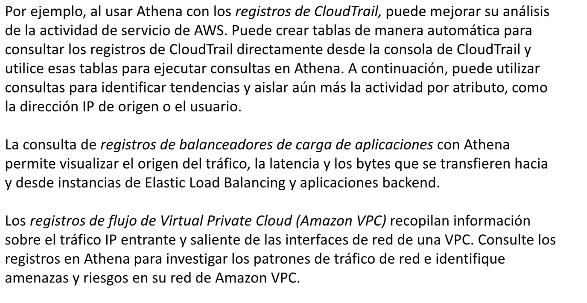
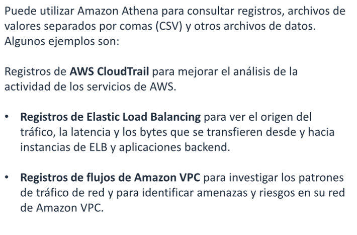

# Integracion de servicios de AWS con Amazon Athena

* Explicacion de como utilizar Amazon Athena para consultar datos de otros servicios de AWS

## Que es Amazon Athena ?

Amazon Athena es un servicio de consultas interactivo que facilita el análisis de datos en Amazon S3 con SQL estándar.
Athena no tiene servidor, de manera que no es necesario administrar infraestructura y solo paga por las consultas que
ejecuta.

Para utilizar amazon Athena, señale los datos en Amazon Simple Storage Service (Amazon S3), defina el esquema y
empiece a realizar consultas mediante SQL standard. La mayoria de los resultados se entregan en cuestion de segundos.
Con Athena, no necesita trabajos ETL complejos para preparar sus datos para el analisis. Athena ayuda a las personas con
conocimientos en SQL a analizar con rapidez los conjuntos de datos a gran escala.

## Introduccion a Amazon Athena

Pasos a seguir:  

## Integraciones de servicios de AWS Con Amazon Athena

Amazon Athena funciona con otros servicios de AWS

Ejemplos de uso:

## Resume

