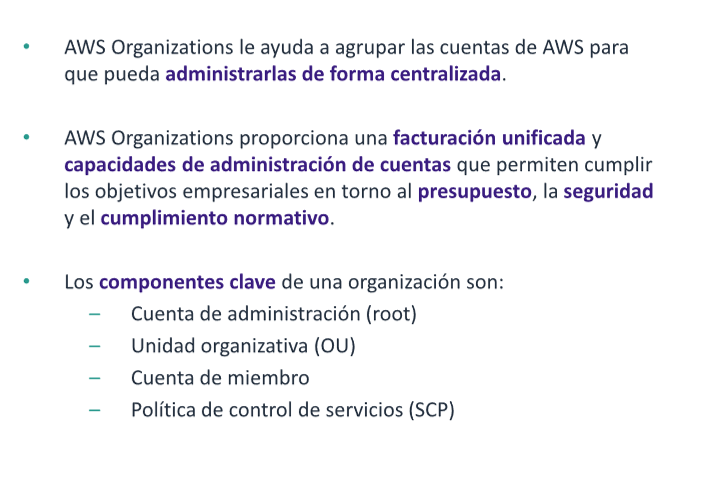

# AWS Organizations

Es un servicio de administracion de cuentas que permite unificar varias cuentas de AWS en una organizacion que se crea y
administra de manera centralizada. AWS organizations incluye funciones de administracion de cuentas y facturacion
consolidadas que le ayudan a satisfacer mejor las necesidades presupuestarias, de seguridad y de conformidad de su
empresa.

## Caracteristicas principales y beneficios

## Seguridad con AWS Organizations

## Configuracion de organizaciones

### Reglas para la asignacion de nombres

### acceso AWS organizations

## Resumen

