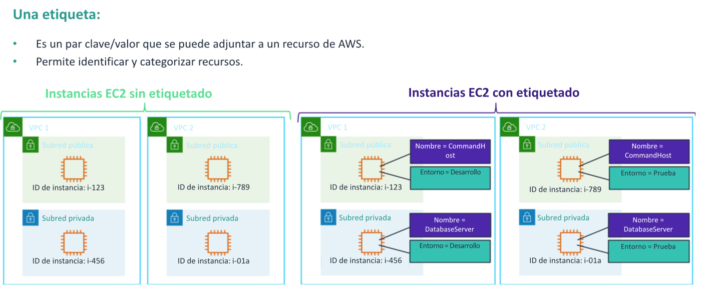
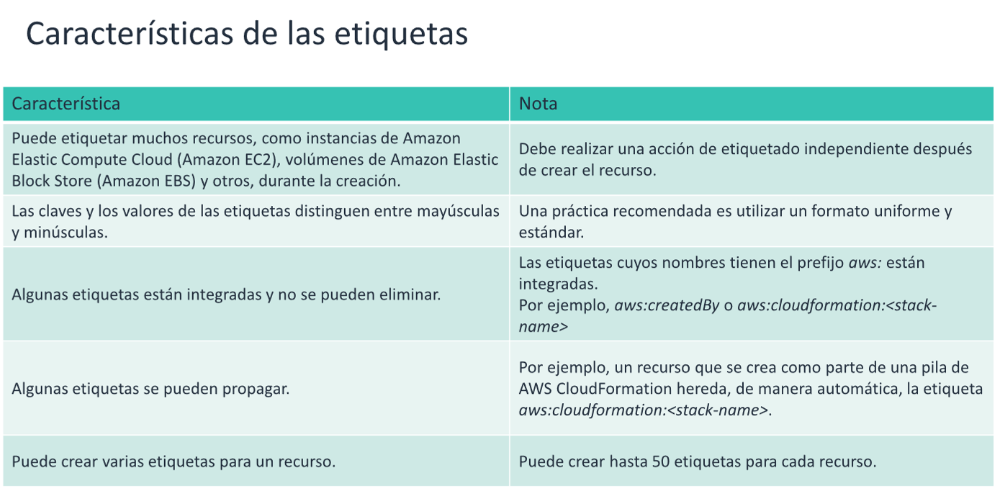
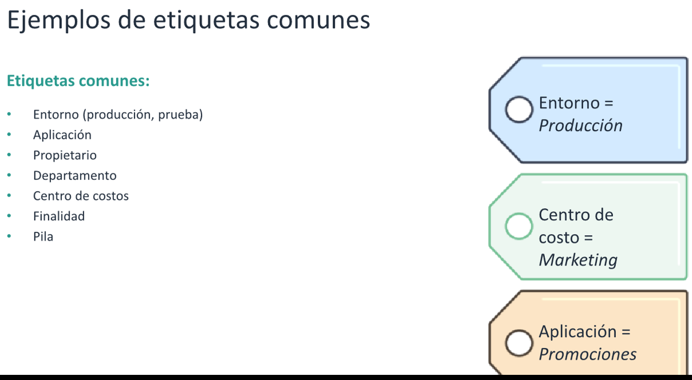
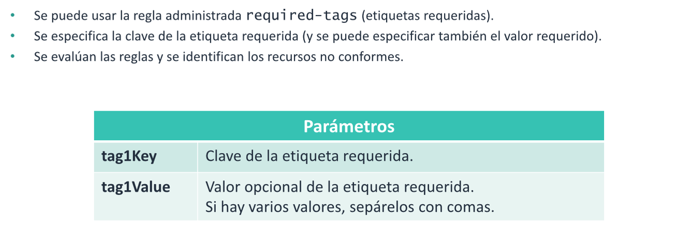
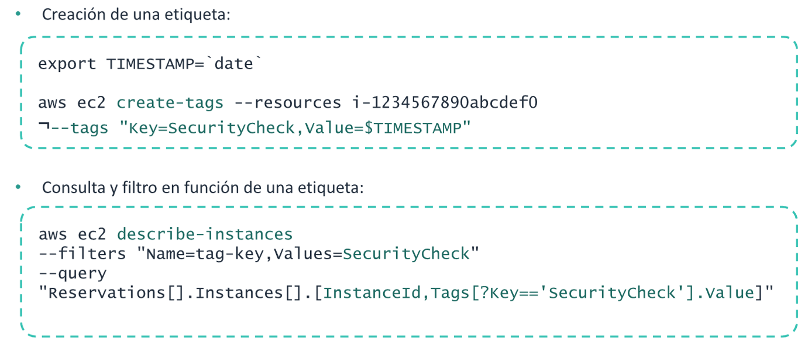
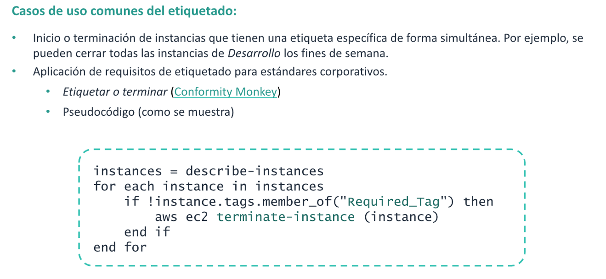
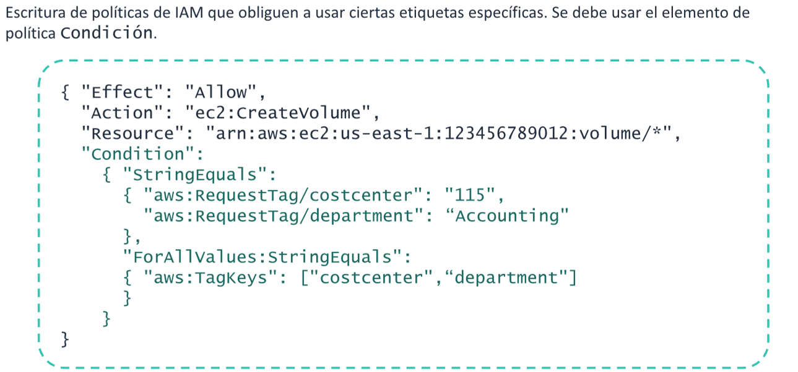
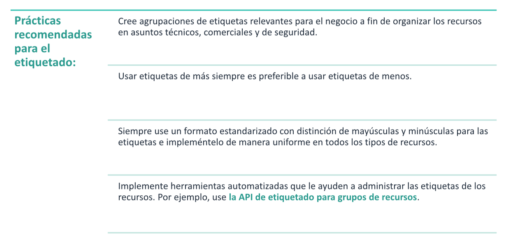
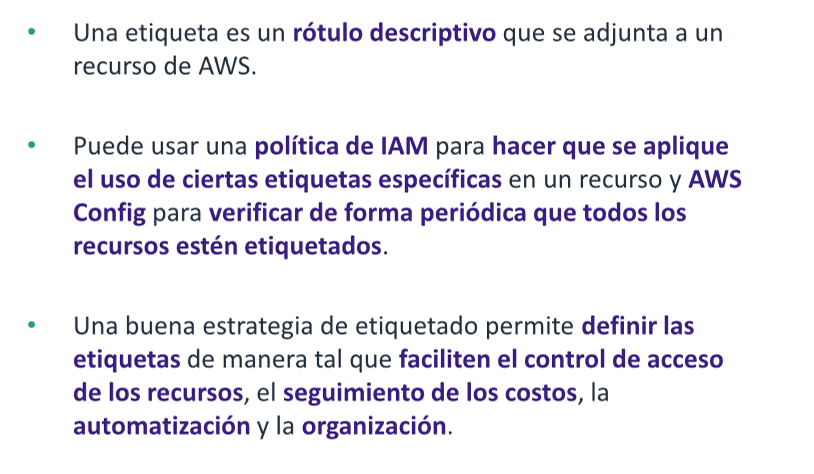

# Etiquetado

Es esta apartado se explorara la administracion del consumo de recursos en una cuenta de aWS mediante etiquetas. Tambien
revisara ejemplo de casos de uso frecuentes de etiquetado que utilizan AWS Config y AWS identity and Access Management(
IAM).

## ¿Que es una etiqueta?

Una etiqueta es un rótulo que se asigna a un recurso de AWS. Le permite identificarlo o categorizarlo de forma
significativa. Cada etiqueta consta de una clave y un valor, ambos definidos por el usuario.

## Caracteristicas

## Ejemplos

Las etiquetas deben representar dimensiones relevantes a nivel organizacional .

## AWS Config Y etiquetado

AWS config proporciona reglas administradas de AWS, que son reglas personalizables y predefinidas que AWS config utiliza
para evaluar si sus recursos de AWS se ajustan a las practicas recomendadas.

## Etiquetado en AWS CLI

## Casos de uso comunes

## Aplicacion del etiquetado IAM

También se puede implementar la escritura de politicas de IAM que obliguen a usar ciertas etiquetas especificas. Por
Ejemplo al crear un recurso , se podria usar una politica de IAM que obligara a cumplir con el uso de las etiquetas
department y cost center a fin de lograr una generacion de informes mas precisos para la asignacion de costos.

## Practicas recomendadas de etiquetado

## Resumen

