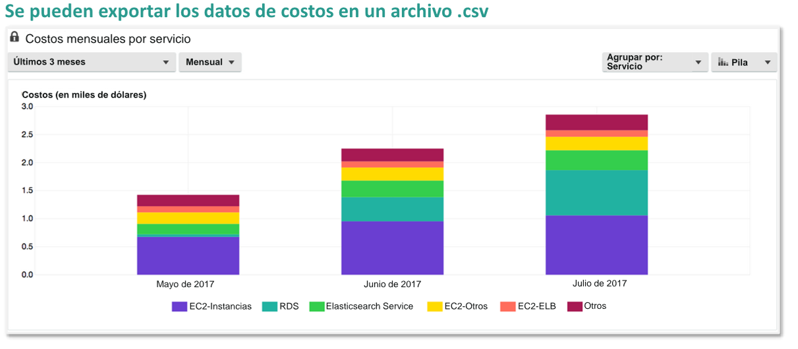

# Administracion de Costos y Practicas Recomendadas

Puntos de este documento:

* Describir algunos de los beneficios en materia de costos de la nube.
* Identificar las herramientas y servicios clave de administracion de costos de AWS.
* Aplicar las mejores practicas para optimizar los costos.

### Beneficios de la nube en materia de costos y oportunidades de reduccion de los costos

### Servicios y herramientas de administracion de costos

### Panel de facturacion de AWS

El panel de facturacion de AWS le permite ver el estado de sus gastos menusales de AWS. Tambien puede utilizarlo para
identificar los servicios que representan la mayor parte de su gasto global. Tmabien puede usar el panel de
factuaracion de AWS para obtener una comprension elevada de las tendencias de costos.

## AWS Bills

## AWs Cost Explore

AWS Cost Explorer le permite ver los costos y el uso , asi como tambien analizarlos para identificar tendencias. Le da
la posibilidad de filtrar y agrupar datos en funcion de diversas dimensiones, como servicio, tipo de instancia y
etiqueta. Cost Explorer proporciona dos tipo de informe;

* Costo y uso
* intancias reservadas

## AWS budgets

Ofrece la posibilidad de definir presupuestos personalizados que alertan cuando los costos o el uso superan el importe
presupuestado(o cuando se preve que lo superaran)

## AWS Cost and Usage Reports

AWS cost and Usage Report es el lugar donde se puede acceder a informacion completa del uso y los costos de aws.

## Alarmas de facturacion de Amazon CloudWatch

## Diseño para la reduccion de costos

## Localizacion y eliminacion de derroches

Otra tecnica eficaz de reduccion de costos es al identificacion y eliminacion de derroches.

### Uso de scritps

Parte del uso de scripts sirve en casos de automatizar el control sobre EC2 , dado que se puede administrar en sistema
como fuera del mismo con AWS lambda. Recomendado para la reduccion de costos.

## Que es AWS Trusted Advisor?

AWS Trusted Advisor es un recurso online que lo ayudara a reducir costos, aumentar el rendimiento y mejorar la seguridad
de su entornode AWS. Analiza su entorno de AWS y le ofrece sugerencias relacionadas en 5 categorias:

* Optimizacion de costos.
* Rendimiento
* Seguridad
* Tolerancia a errores
* Service Limits

### Caracteristica de optimizacion de costos de AWS

## Resumen

