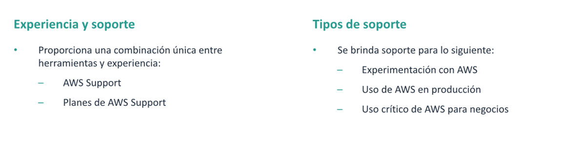
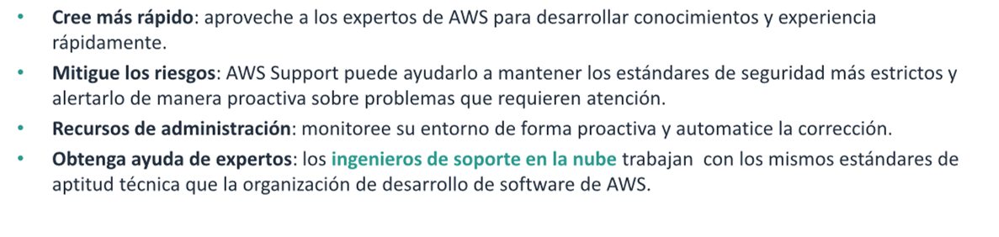
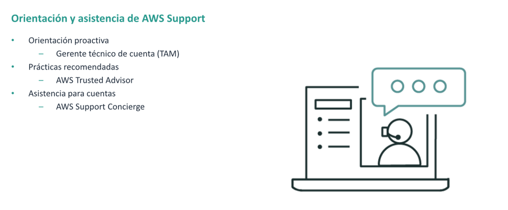
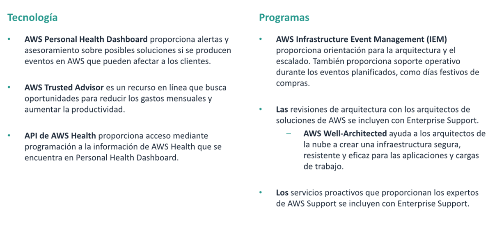
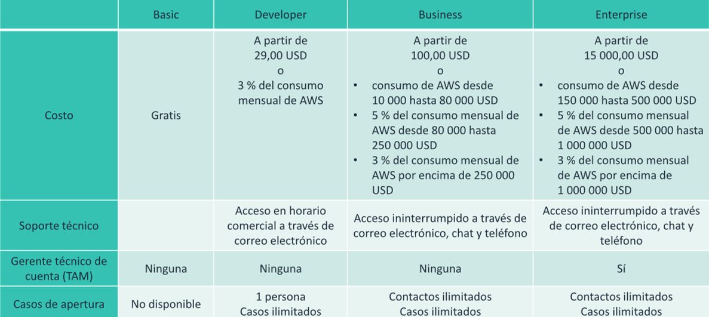
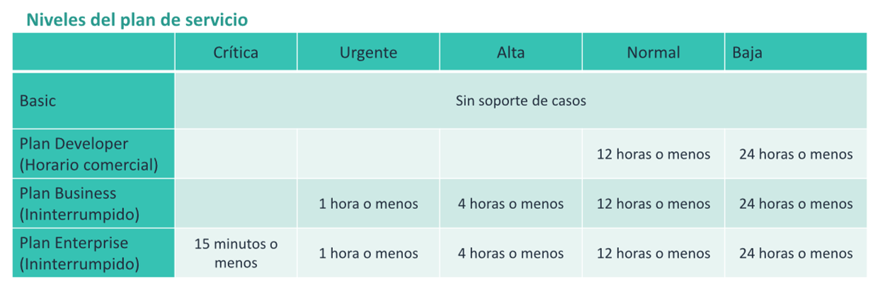

# AWS Support

En este documento se explorara los planes de sorporte tecnico de AWS

## Servicios de AWS

AWS support proporciona una combinacion de herramientas y tecnologia, personas y programas. Los recursos de AWs support
se han diseñado para ayudarlo de manera proactiva a optimizar el rendimiento, reducir los costos e innovar de forma
rapida.

### Planes de AWS support

* Basic support : acceso al centro de recursos , service health dashboard, las preguntas frecuentes sobre productos, los
  forors de discusion y el soporte para comprobaciones de estado.
* Developer Support: soporte para el desarrollo inicial en AWS
* Businnes Support: soporte para clientes que ejecutan cargas de trabajo de produccion.
* Enterprise Support: Soporte destinado a los clientes que ejecutan cargas de trabajo criticas para los negocios

### Beneficios

### Funcionamiento

## Tecnologia y Programas de AWS Support

## Planes De AWS

## Planes de AWS Support: precios y servicios

