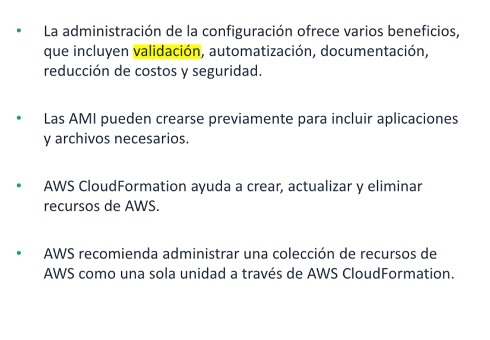

# Administracion de la configuracion en la nube

* Describir los beneficios de la administracion de la configuracion
* identificar los servicios clave de AWS para administrar la configuracion
* Crear una estrategia de administracion de la configuracion

# Beneficios de la adnimistracion de la configuracion

Es importante planificar la configuracion y la organizacion de los recursos de AWs de forma proactiva en lugar de
reactiva. Los recursos pueden abarcar varios servicios de AWS. Por lo general , los recursos incluyen los siguientes
recursos, ademas de otros, que componen la infraestrutura implementada en aws:

* Instancias de amazon elastic computé cloud (EC2)
* Grupos de auto scalling
* Grupos de seguridad
* Equilibradores de carga de Elastic Load Balancing

La configuracion manual de sistemas distribuidos requiere mucho tiempo , es propensa a errores y puede dar lugar a falta
de uniformidad en la configuracion de los sistemas.La administracion de la configuracines ofrece muchos beneficios. uno
de los principales es que le permite lanzar nuevos recursos con rapidez.

## Herramientas de administracion de la configuracion

## Tecnologias para configurar intancias EC2

## Resumen

