# Estrategia de creacion de AMI

* Describir la propuesta de valor del uso de una (AMI)
* Creacion de una AMI
* Explicar las caracteristicas de una AMI
* Identificar recomendaciones para crear una AMI de microsoft Windows

## AMI personalizadas como configuracion basica

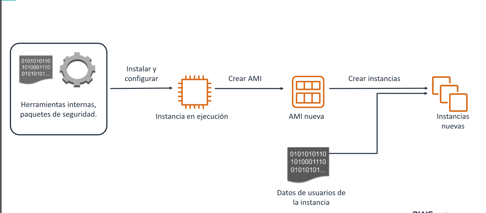

Supongamos que uno de los problemas mas grandes de una empresa que por estandar la seguridad ya fue profranada, a lo que
las configuraciones futuras tienes que tener un estandar de ello, pero no es conveniente instalar un script o
manualmente las estrategias de las mismas una y otra vez, para ello podemos personalizar las AMI's , para que tengamos
un panorama mejor optimizado.

Pasos para desarollar una AMI personalizada:

- Lance una instancias EC2 desde una AMI estandar.
- Preconfigure toodo el software que necesita la organizacion en una instancia de Amazon EC2.
- Cree una AMI personalizada dede esa instancia.

La nueva AMI personalizada se convierte en la AMI que se utiliza para crear todas las instancias nuevas dentro de la
organizacion.

Para aplicar politica , unicamente tendra que:

* Crear procesos que analicen las instancias en ejecuccion en su cuenta.
* Terminar todas las instancias que no utilicen las AMI estandar.

## Configuracion instancias en el tiempo de arranque

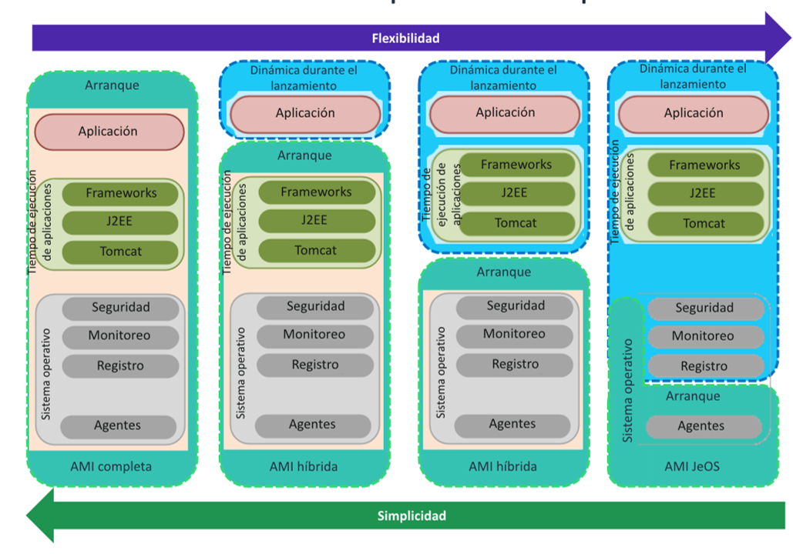
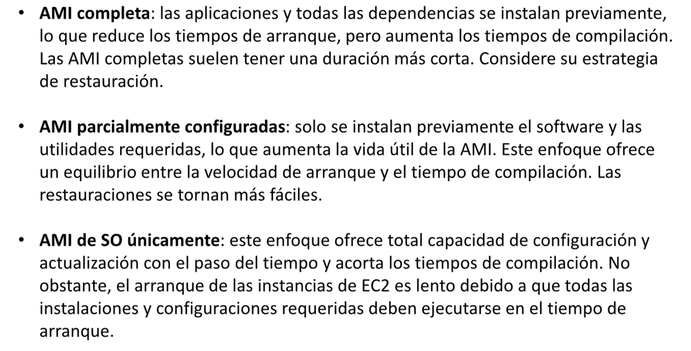

## Crear AMI

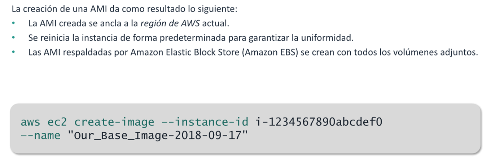

## Copiar AMI en distintas regiones de AWS

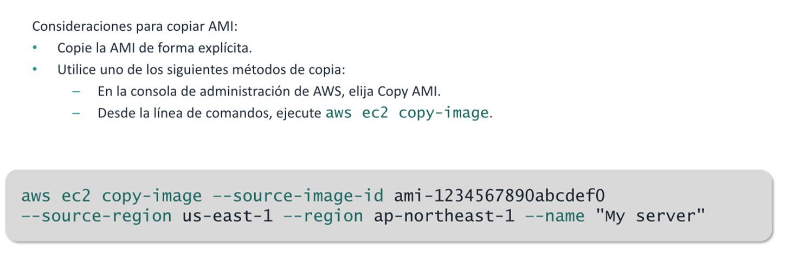

## Detalles sobre la creacion de AMI

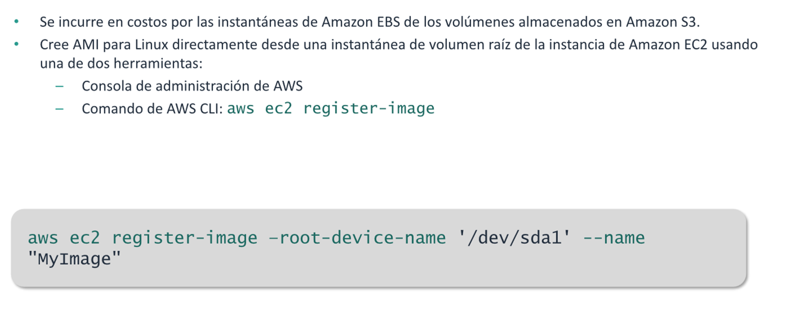
Cuando crea una AMI , Amazon EC2 crea instantaneas del volumen raiz de la instancia y de cualquier otro volumen EBS
adjunto a la instancia . Se cobra por las instantaneas hasta que anule el registro de la AMI y las elimine.

## Creacion de AMI para Microsoft Windows

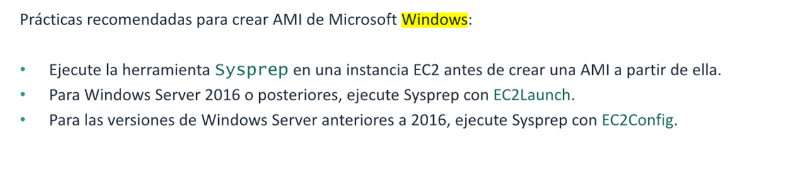
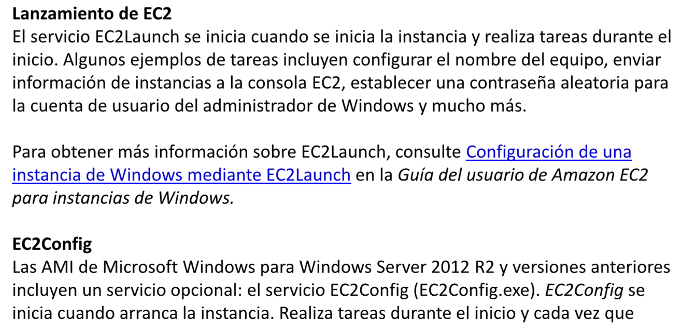

### Fases de Sysprep

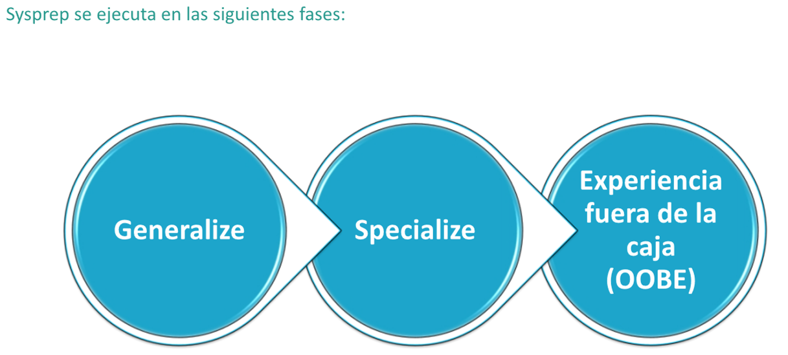
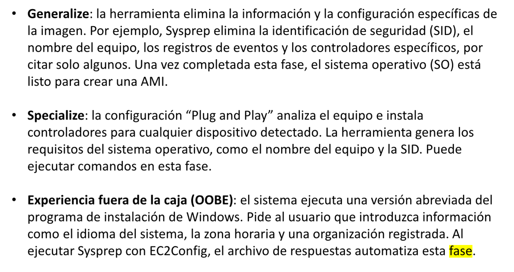

## Resumen

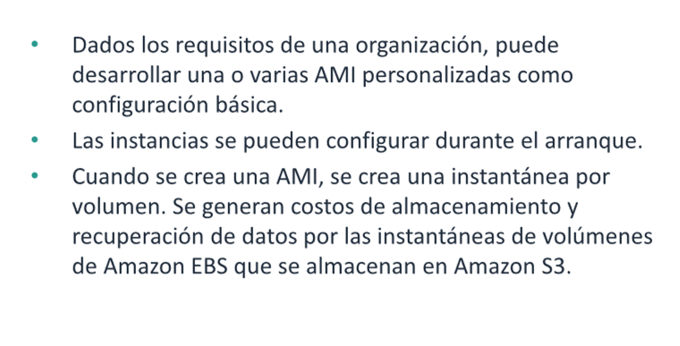