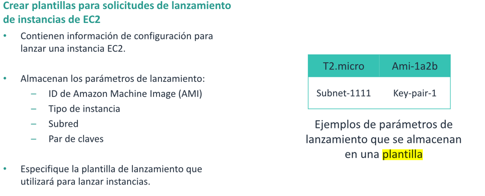
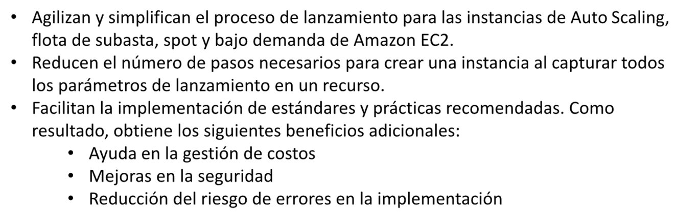
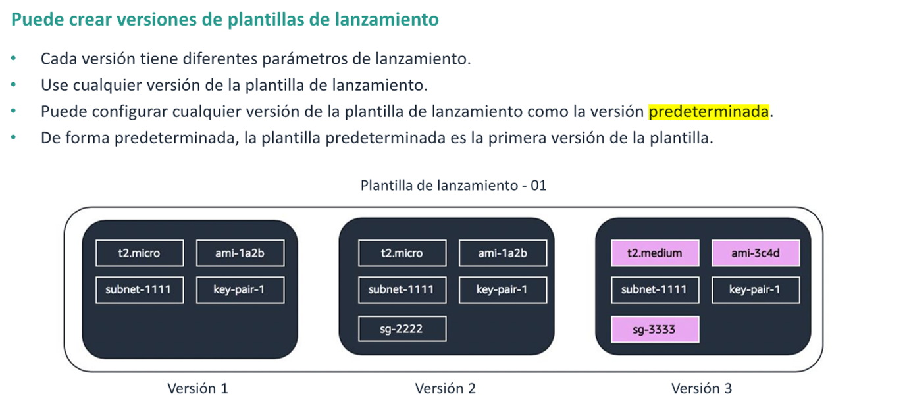
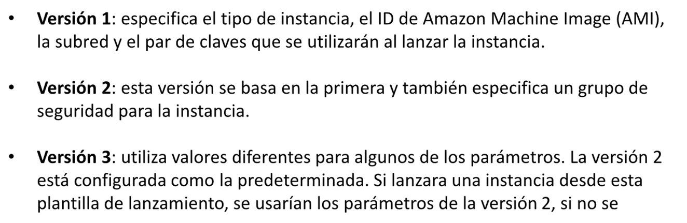
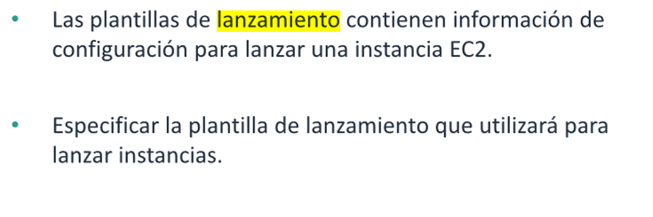

# Plantillas de lanzamiento EC2

* Describir el proposito de una plantilla de lanzamiento para instancias de Amazon Elastic Compute Cloud(EC2)
* Crear una plantilla de lanamiento
* Explicar las versiones de las plantillas de lanzamiento

## Plantilla de lanzamiento

Las plantillas de lanzamiento le permiten crear plantillas para las solicitudes de lanzamiento. Al Crear una plantilla
de lanzamiento, puede especificar las siguientes configuraciones:

* Tipo de instancia
* Subred en la que se lanzara la instancia
* Par de claves
* Grupos de seguridad

Las plantillas de lanzamiento ofrecen las siguientes Ventajas:

## Versiones de una plantilla de lanzamiento

## Resumen

