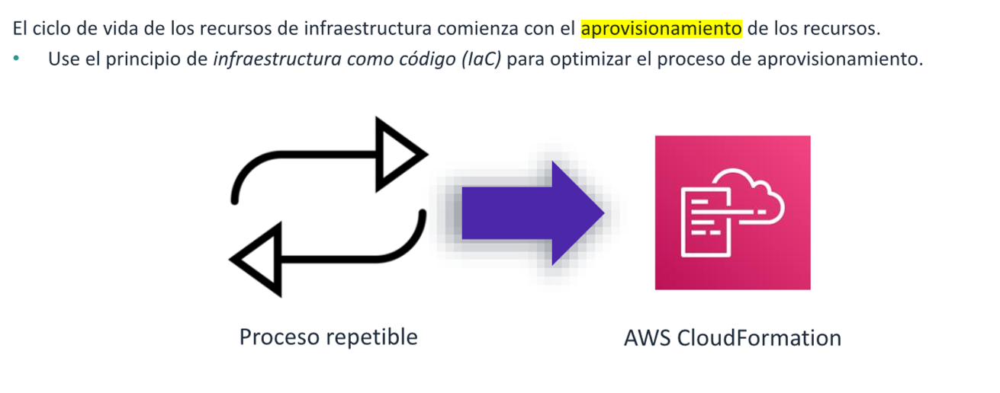
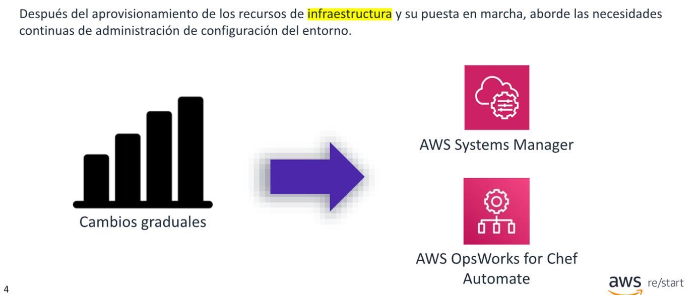
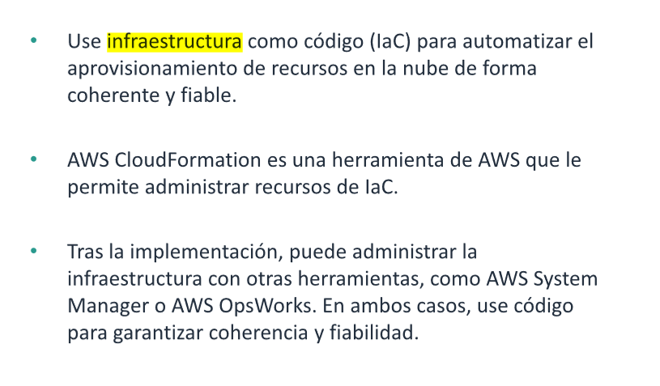

# Infrastrectura como codigo

* Describir lo que es infrasestructura como codigo (IaC) y el valor que ofrece

## Aprovisionamiento de recursos

EI proceso de creación de recursos de infraestructura debe ser coherente y fiable. La
infraestructura como código (laC) es un marco de referencia para implementarlos.
AWS CloudFormation es un servicio que permite crear infraestructura con código.

* Creación de entornos de réplica para experimentar nuevos servicios, pruebas en
  Ún espejo de la infraestructura de producción o rápida implementación de
  entornos de recuperación tras un desastre.
* Creación de entornos temporales para demostraciones. Por lo general, cuando se
  realiza la demostración de un servicio, se hace mediante una infraestructura que
  no es un espejo de un entorno real. Con laC, se puede implementar una copia de
  la producción y utilizar rápidamente para la demostración.
* A fin de reducir costos, los entornos de desarrollo para programadores se pueden
  poner en marcha cuando sea necesario. Y, cuando no sea necesario, se puede
  eliminar el entorno. Esta flexibilidad no solo permite ahorrar dinero, sino que
  también garantiza que los desarrolladores creen software que funcione con
  sistemas de producción actuales.

## Administracion de la configuracion

Considere las siguientes situaciones:

* Un administrador de publicaciones desea implementar una versión de una
  aplicación en un grupo de servidores. Si hay problemas, los administradores de
  publicaciones desearán volver a una versión anterior del trabajo.
* Un administrador de sistemas recibe una solicitud para instalar un nuevo paquete
  de sistema operativo en entornos para desarrolladores, pero sin tocar los otros
  entornos.
* Un administrador de aplicaciones necesita actualizar periódicamente un archivo de
  configuración en todos los servidores en los que se aloja una aplicación.

Una forma de abordar estas situaciones es regresar a la etapa de aprovisionamiento,
aprovisionar recursos nuevos con los cambios solicitados y quitar los recursos
anteriores. Este enfoque, que también se conoce como inmutabilidad de
infraestructura, garantiza que los recursos aprovisionados se creen nuevamente, de
acuerdo con el código estándar, cada vez que se haga un cambio. Mediante este
proceso, se reducen las desviaciones en la configuración. Una desviación de
configuración significa que la configuración real de los recursos difiere o se desvió de
la configuracion esperada.

Sin embargo, es posible que desee adoptar un enfoque diferente en ciertos casos.
Algunos entornos mantienen altos niveles de durabilidad en los que las transacciones
o los datos se almacenan de forma permanente. Por 10 tanto, los cambios
confirmados en una base de datos se pueden recuperar o reconstruir en su totalidad.
En estos entornos, podría ser mejor contar con formas de hacer cambios graduales
en los recursos actuales, en lugar de volver a aprovisionarlos. Puede administrar estos
cambios con AWS Systems Manager y AWS OpsWorks for Chef Automate.

AWS Systems Manager brinda a los ingenieros información sobre la infraestructura de
AWS existente. Esto incluye la automatización de muchas tareas repetitivas y la
reducción del tiempo necesario para identificar problemas operativos. System
Manager también permite la automatización hacia una mejora de la precisión y la
eficiencia de las tareas de mantenimiento.

Como System Manager, AWS OpsWoks for Chef Automate permite automatizar y
mejorar la eficiencia de muchas tareas al ofrecer un servidor Chef administrado y
herramientas que facilitan las implementaciones, las pruebas, la seguridad y la
visibilidad y el estado de los recursos en el entorno de la nube.

## Resumen

