## Pseudoparametros

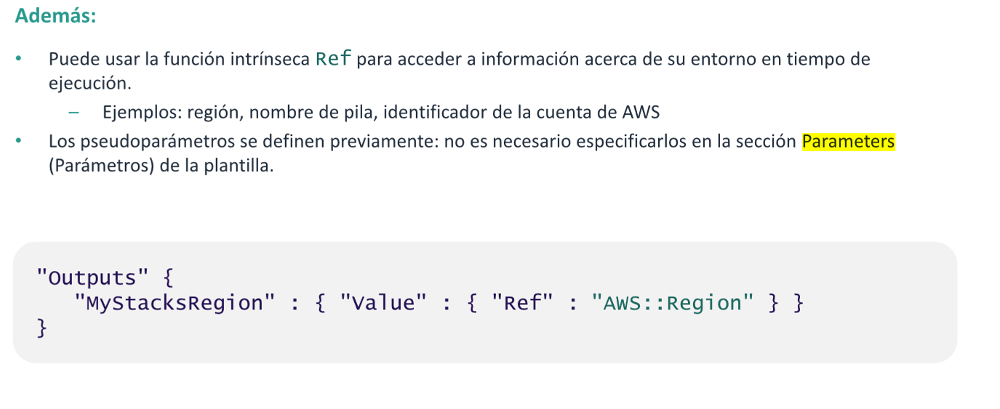
La función intrínseca Reftambién suele utilizarse para acceder a información sobre el
entorno en tiempo de ejecución, como la región, el nombre de la pila o el
identificador de la cuenta de AWS. Estos valores del entorno en tiempo de ejecución
están disponibles mediante pseudoparámetros.
Los pseudoparámetros son parámetros predefinidos por AWS CloudFormation. No los
declara en la plantilla. Puede usarlos de la misma forma en que usaría cualquier otro
parámetro: como el argumento para la función Ref.
En el ejemplo, AWS::Region es un pseudoparámetro. Se resolverá en la región en la
que se está ejecutando la plantilla de AWS CloudFormation para crear la pila.

## Definir Mapeos en una plantilla

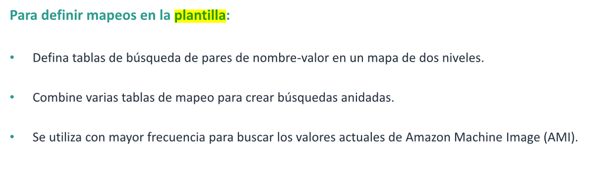
Recuerde que una de las secciones opcionales de la plantilla es la sección Mappings
(Mapeo). Un mapeo hace coincidir una clave con el conjunto correspondiente de
valores identificados. Por ejemplo, supongamos que desea establecer valores
basados en una región. Puede crear un mapeo que utilice el nombre de la región
como clave y que también contenga los valores que desea especificar para cada
región específica. Puede utilizar la función intrínseca Fn::FindlnMap para recuperar
valores en un mapa.
Los mapeos se suelen utilizar para hacer referencia a los identificadores de AMI de las
AMI más actuales de una región, porque las AMI difieren según la región. También
suelen cambiar con el tiempo a medida que se publican nuevas AMI.
No se pueden incluir parámetros, pseudoparámetros ni funciones intrínsecas en la
sección Mappings (Mapeo).
Para obtener más información, consulte Mappings (Mapeo).

### Ejemplo de mapeo

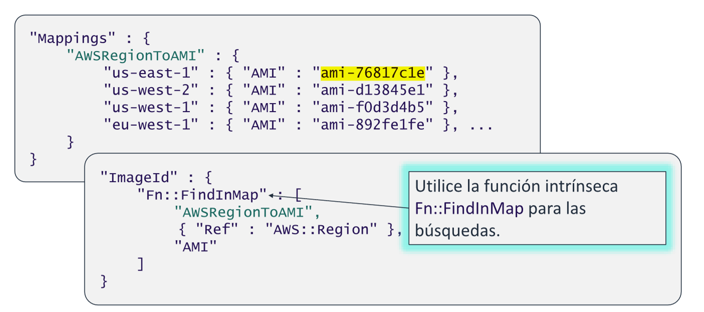
EI siguiente fragmento de JSON muestra cómo se podría utilizar la función intrínseca
Fn::FindlnMap para buscar el identificador de AMI correcto que se almacenó en el
mapa. Requiere el pseudoparámetro AWS:Region, que se resuelve en una región real.

## Definir recursos en una plantilla

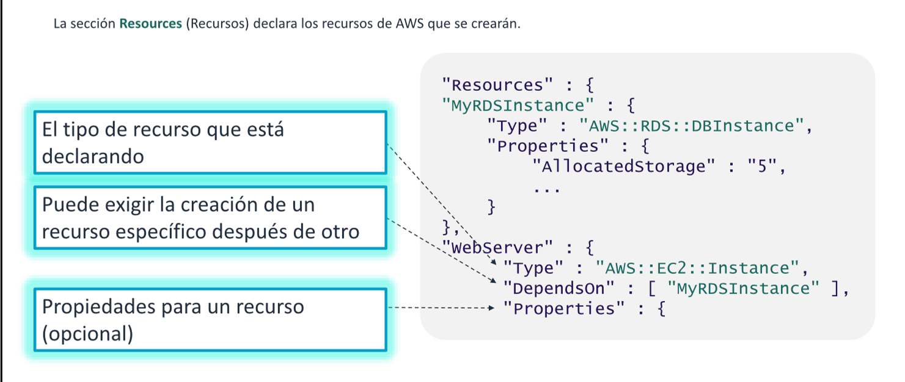
La sección obligatoria Resources (Recursos) de una plantilla de AWS CloudFormation
declara los recursos de AWS que se desea incluir en la pila, como una instancia EC2 0
S3 Bucket. Cada recurso se debe declarar por separado. Sin embargo, puede
especificar varios recursos del mismo tipo. Si declara más de un recurso, sepárelos
con comas.
En este ejemplo, se crearán dos recursos: una instancia de Amazon Relational
Database Service (Amazon RDS) y una instancia EC2.
La instancia EC2, denominada WebServer, depende de la instancia de RDS. La base de
datos debe crearse antes de que las aplicaciones que se ejecutarán en el servidor
web puedan utilizarla. Aunque el servicio AWS CloudFormation realiza cierta
secuenciación de tareas de creación de recursos automáticamente, estas reglas
cambian a medida que se admiten nuevos tipos de recursos en el sistema. Para
garantizar la secuenciación uniforme de las tareas de creación de recursos, se
recomienda usar el atributo DependsOn.

## init - CloudFormation::Init

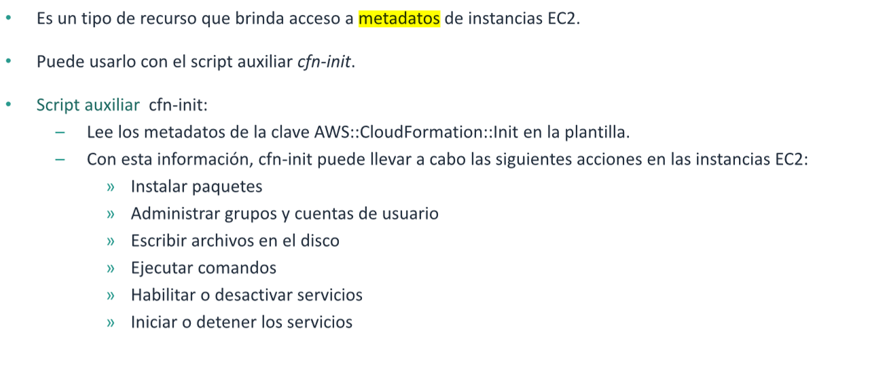
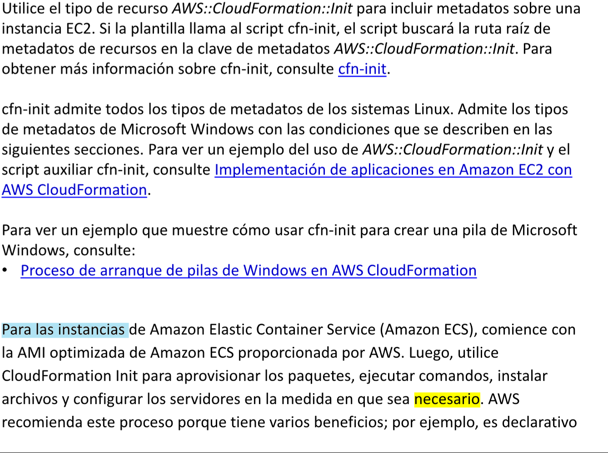
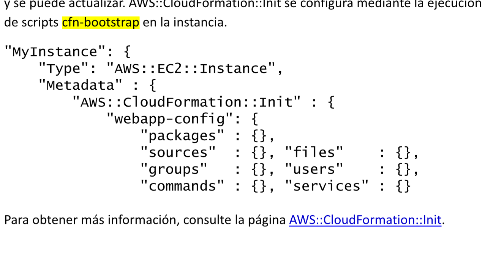

## Datos del usuario VS CloudFormation::Init

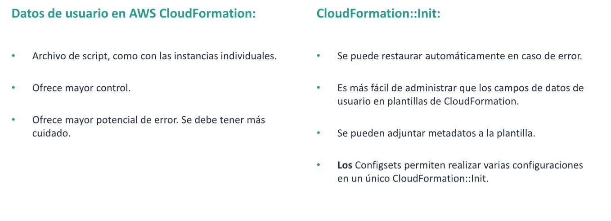
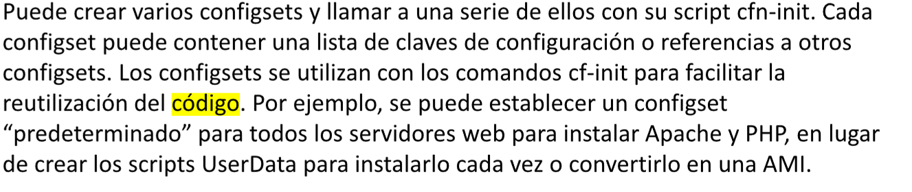

## Waitcondition y WaitConditionHandle

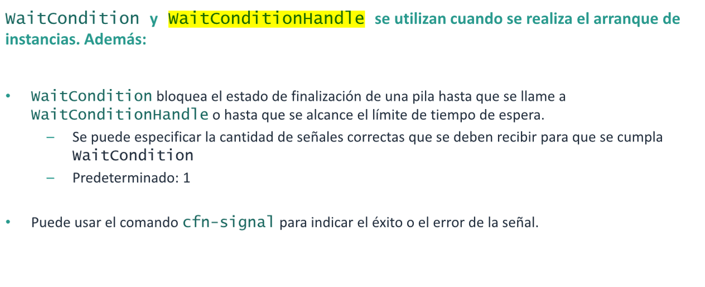

En el caso de AWS, una instancia EC2 se considera lista cuando supera las
comprobaciones de estado. Sin embargo, pasar comprobaciones de estado podría no
significar que la instancia esté lista en términos de las instalaciones y las
configuraciones que espera que tenga la instancia EC2. Es posible que los datos de
usuario y los scripts sigan instalando software que convierte la instancia en un servidor
de base de datos, en un servidor de SharePoint o en un nodo de un clúster de
procesamiento de datos.  
Para indicarle a AWS CloudFormation que la instancia está lista, es necesario usar una
WaitCondition. Piense en una WaitCondition como una señal de pare que evita que
AWS CloudFormation marque la pila como completa antes de que el código envíe una
señal de que ha terminado. WaitConditionHandle es una representación textual de la
WaitCondition que el código de inicialización puede usar para indicar a AWS
CloudFormation que se ha creado el recurso.  
EI código de inicialización es responsable de llamar al comando cfn-signal en la
instancia para indicar que ha terminado su trabajo. Esto es así tanto más allá de si el
código se encuentra en los datos del usuario o en un script independiente que se
descarga en la instancia mediante CloudFormation::lni t. Puede indicar que la tarea se
ha realizado correctamente. Si una tarea se lleva a cabo correctamente, AWS
CloudFormation empezará a crear el siguiente recurso de la pila o marcará toda la pila como completada. O bien, puede
marcar que la tarea presentó errores. Si una tarea
presenta errores, de forma predeterminada, AWS CloudFormation revierte todos los
recursos de la pila que se hayan creado hasta la fecha.

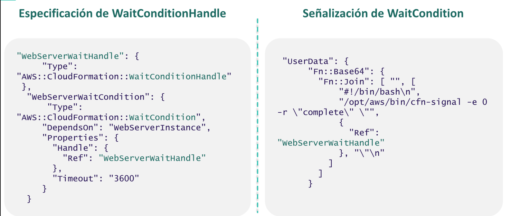
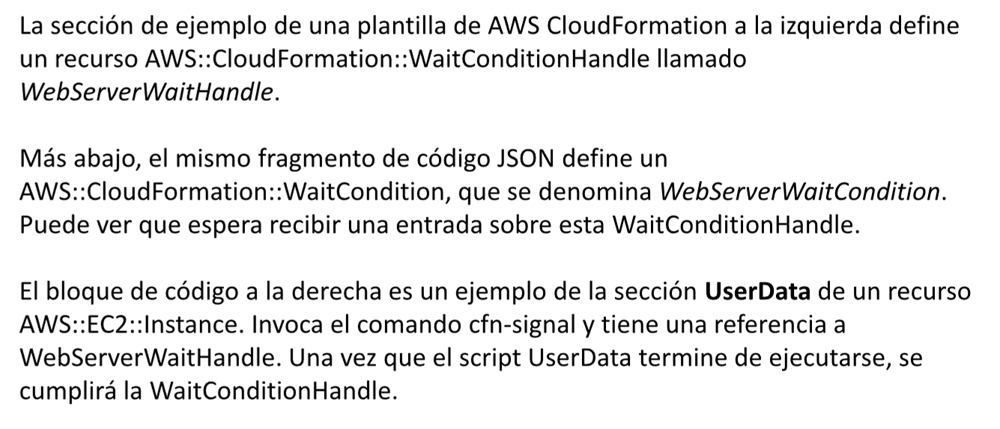

## Definir resultados en una plantilla

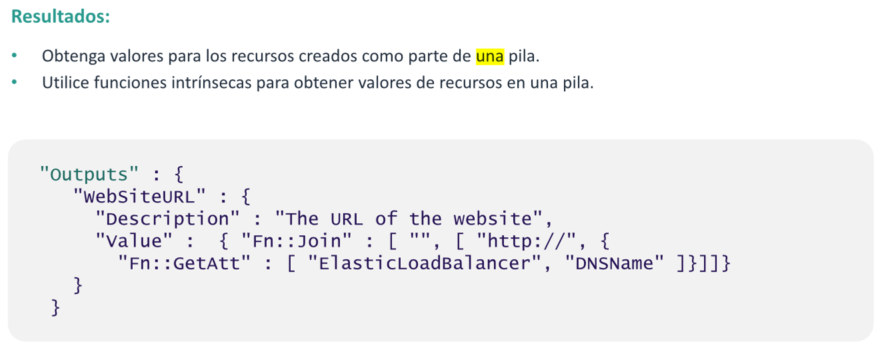
Outputs (Resultados) es una sección opcional en una plantilla de AWS
CloudFormation. La sección Outputs (Resultados) devuelve valores de cadena que
creó la plantilla y que podrían ser importantes para los usuarios. Por ejemplo, si se
crea una instancia de Amazon EC2 que funciona como un servidor web público, se
podría optar por generar el nombre del sistema de nombres de dominio (DNS)
público completo del servidor en la sección Outputs (Resultados).  
En el ejemplo, se devolverá el nombre DNS de un balanceador de cargas de Elastic
Load Balancing, que también debe definirse en la sección Resources (Recursos) de la
misma plantilla de AWS CloudFormation. Se conocerá la URL del sitio web que está
disponible a través del balanceador de cargas.  
Después de ejecutar la pila, los resultados se muestran en la pestaña Outputs
(Resultados) de la consola de AWS CloudFormation. Si usa la API o AWS CLI para
ejecutar la pila, también puede recuperar resultados de manera programática.

## Opciones adicionales de pila de AWS CloudFormation

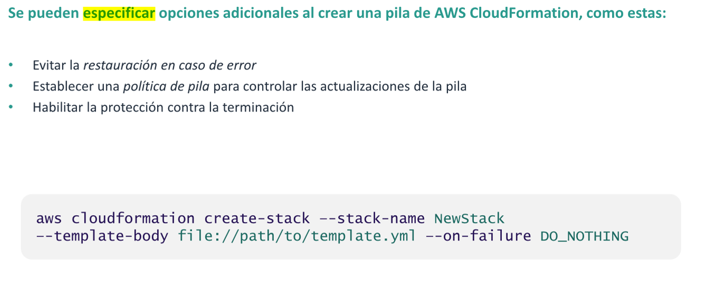

## Anular restauraciones de actualizaciones con error

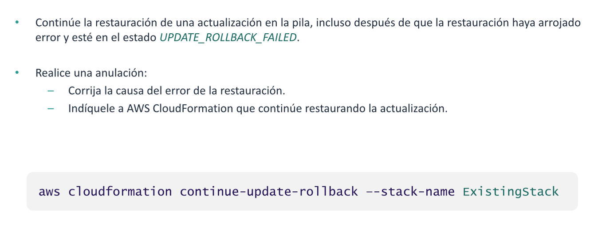
