# AWS CloudFormation

* Describir el proposito de AWS CloudFormation
* Crear una plantilla de AWS CloudFormation
* Aplicar las practicas recomendadas para AWS Cloud Formation

## Presentación de AWS Lambda.

AWS Lambda es un servicio de cómputo sin servidor que se basa en eventos. Puede utilizar
Lambda para ejecutar códigos sin aprovisionar ni administrar servidores. Paga solo por el
tiempo de cómputo que consume. No se cobra ningún cargo cuando el código no se está
ejecutando.

## Desafios de implementacion en la nube

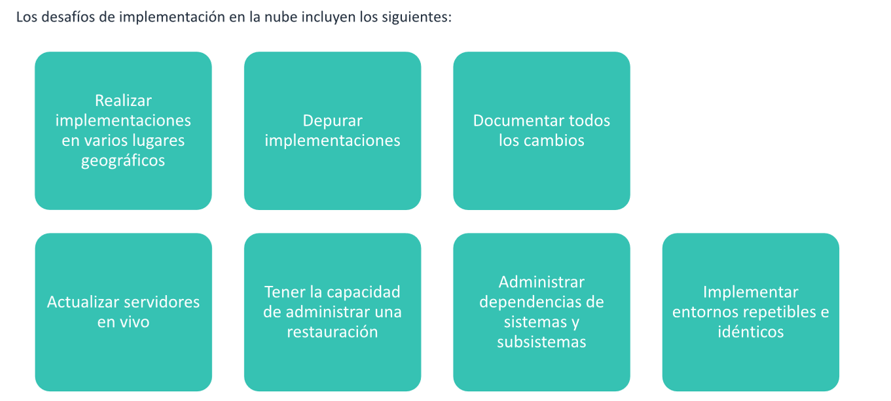

La nube da lugar a muchas posibilidades. Sin embargo, también plantea preguntas
sobre cómo administrar su potencia y flexibilidad, como las siguientes:

* ¿Cómo se actualizan los servidores que ya se han implementado en un entorno de
  producción?
* ¿Cómo se implementa una infraestructura en varias regiones y en diferentes
  lugares geográficos de manera uniforme?
* ¿Cómo se restaura una implementación que no se haya ejecutado según lo
  planeado? En otras palabras, ¿cómo se reclaman los recursos que ya se crearon?
* ¿Cómo se prueba y depura una implementación antes de lanzarla a producción?
* ¿Cómo administra las dependencias de sistemas y tecnologías, así como en
  subsistemas enteros (p. ej., un sitio web implementado en una infraestructura de
  eCommerce)?

## AWS CloudFormation

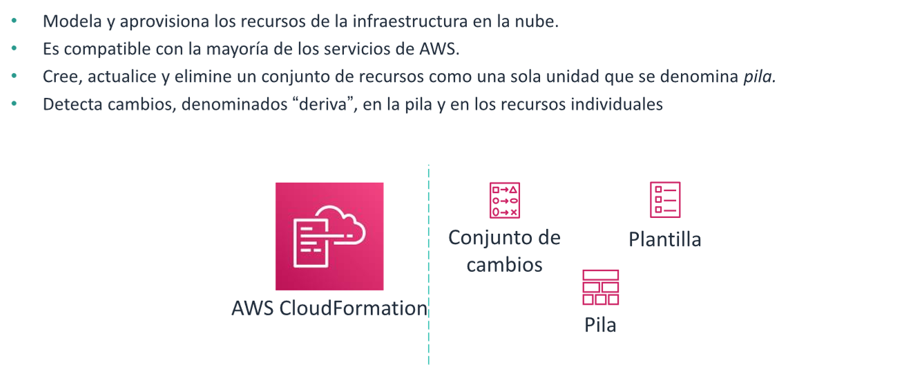
AWS CloudFormation le permite crear y aprovisionar implementaciones de
infraestructura de AWS de manera predecible y repetible. Puede utilizar AWS
CloudFormation en servicios como Amazon Elastic Compute Cloud (Amazon EC2),
Amazon Elastic Block Store (Amazon EBS), Amazon Simple Notification Service
(Amazon SNS), Elastic Load Balancing y Auto Scaling. AWS CloudFormation le permite
usar un archivo de plantilla para crear y eliminar un conjunto de recursos, que se
administran como una única unidad (una pila).

Los cambios fuera de los requirimientos de la plantilla suelen ser un problema , pero la
forma en la cual pueden ser. Puede utilizar la detección de desviación para identificar en qué recursos de la pila se
realizaron cambios de configuración fuera de la administración de AWS
CloudFormation. Luego podrá tomar medidas correctivas para que los recursos de la
pila vuelvan a sincronizarse con sus definiciones en la plantilla de la pila. Por ejemplo,
podría actualizar los recursos desviados directamente para que coincidan con la
definición de su plantilla. A1 solucionar la desviación se garantiza la uniformidad de la
configuración y el éxito de las operaciones de la pila.

## Terminologia de AWS CloudFomation

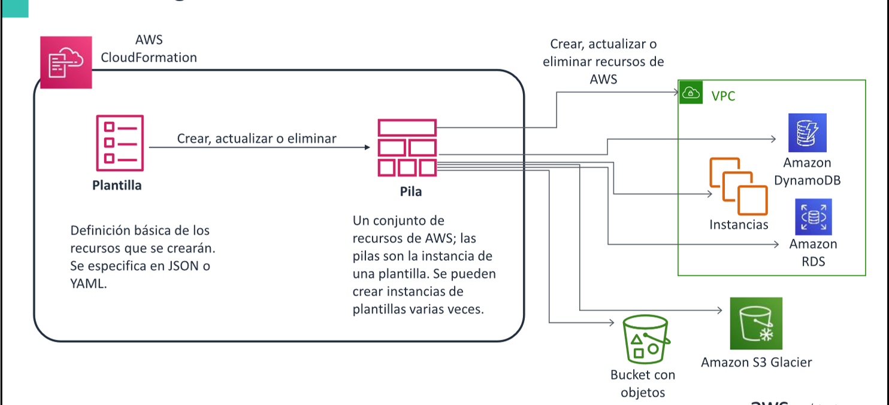

Dos términos importantes para AWS CloudFormation son las plantillas y las pilas.
Una plantilla es una especificación de los recursos de AWS que se aprovisionarán.
Una pila es un conjunto de recursos de AWS que se crearon a partir de una plantilla.
Puede aprovisionar (crear) una pila muchas veces.
Cuando se aprovisiona una pila, se crean los recursos de AWS que están especificados
en la plantilla de la pila. Los cargos generados por el uso de estos servicios
comenzarán a acumularse cuando se creen como parte de la pila de AWS
CloudFormation.
Al eliminar una pila, se eliminan los recursos que están asociados con esa pila. AWS
CloudFormation determina el orden de eliminación. No tiene control directo sobre el
momento en que se elimina cada recurso.

## Estructura de la plantilla

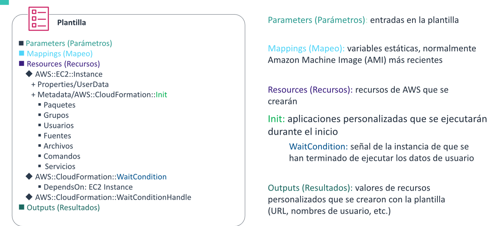
**Parameters** (Parámetros) es una sección opcional de la plantilla. Cuando hay parámetros, estos
incluyen pares de nombre-valor. Se puede hacer referencia a estos parámetros más adelante en la
plantilla.

**Mappings** (Mapeo) es una sección opcional de la plantilla. Los mapeos suelen utilizarse para hacer
referencia a los valores de Amazon Machine Image (AMI) más recientes de una región porque
difieren según la región. También cambian con el tiempo a medida que se lanzan nuevas AMI.

**Resources** (Recursos) es una sección obligatoria de la plantilla. La sección Resources (Recursos)
contiene los objetos de AWS que se crearán. Puede crear recursos en una gran cantidad de servicios
de AWS, incluidos Amazon EC2, Amazon Simple Storage Service (Amazon S3), Amazon Virtual
Private Cloud (Amazon VPC) y muchos otros. Puede especificar relaciones y dependencias entre los
recursos para asegurarse de que estos se creen en el orden correcto.

**Init**. EI tipo de recurso CloudFormation::lnit le permite implementar aplicaciones, archivos y otros
recursos en las instancias EC2 como parte del proceso de implementación.

**WaitCondition**. EI tipo de recurso CloudFormation::WaitCondition se usa para coordinar la creación
de recursos. Por ejemplo, supongamos que un recurso depende de otro recurso. AWS
CloudFormation esperará a que se completen otras actividades de creación de recursos antes de
intentar crear el recurso dependiente. WaitCondition le permite enviar una señal a AWS cuando los
comandos de CloudFormation::lnit terminen de ejecutarse correctamente.

**Outputs** (Resultados) es una sección opcional de la plantilla. La sección Outputs (Resultados)
devuelve valores de cadena que se crean en la plantilla y que podrían ser importantes para los
usuarios. Por ejemplo, si crea una instancia EC2 que funciona como un servidor web público,
podría optar por generar el nombre del servidor de nombres de dominio (DNS) público completo
del servidor en la sección Outputs (Resultados).

## Editar plantillas de AWS CloudFormation

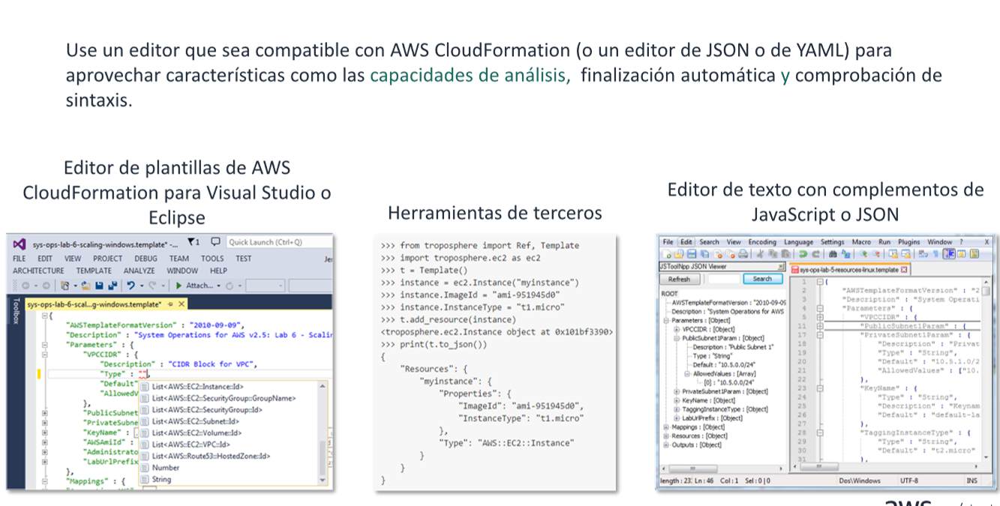

## Diseñar Plantillas

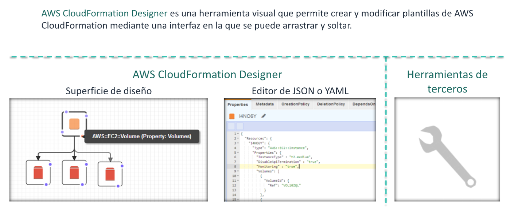
AWS CloudFormation Designer es una herramienta visual que permite crear y
modificar plantillas de AWS CloudFormation mediante una interfaz en la que se
puede arrastrar y soltar. Puede agregar, modificar o eliminar recursos y, al hacerlo, el
código JSON o YAML subyacente se modificará en consonancia. Si modifica una
plantilla asociada con una pila en ejecución, puede actualizar la pila, de modo que se
corresponda con la plantilla.
Ciertas herramientas de terceros también podrían brindarle soluciones para diseñar
plantillas de AWS CloudFormation.

## Lanzar y eliminar pilas

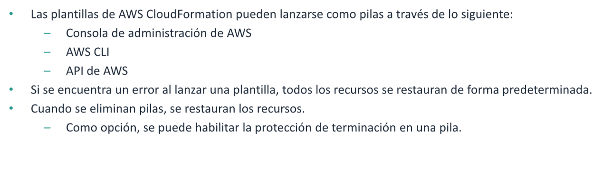
AWS CloudFormation garantiza que todos los recursos de la pila se creen o se
eliminen según corresponda. Dado que AWS CloudFormation trata los recursos de la
pila como una unidad, todos ellos deben crearse o eliminarse correctamente para
poder crear o eliminar la pila. Si no es posible crear un recurso, AWS CloudFormation
restaura la pila y elimina automáticamente cualquier recurso que se hubiera creado.
Si no es posible eliminar un recurso, los recursos restantes se retienen hasta que se
pueda eliminar correctamente la pila.
Para conservar un volumen de Amazon Elastic Block Store (Amazon EBS), defina el
atributo deleteOnTermination en False.
Para conservar un recurso, configure el atributo DeletionPolicy en Retain (Retener).
Es posible que algunos recursos no se eliminen al eliminar una pila, como un bucket
de S3.
Como opción, puede habilitar la protección de terminación en una pila.

## Definir parametros en una plantilla

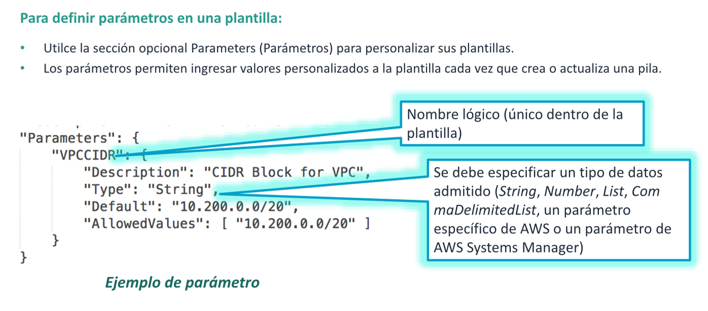
Utilice la sección opcional Parameters (Parámetros) para personalizar las plantillas. Los
parámetros permiten ingresar valores personalizados a la plantilla cada vez que crea o
actualiza una pila.
En el ejemplo, al parámetro se le asignó el nombre lógico de VPCCIDR. EI nombre lógico
que se asigna a un parámetro debe ser único en toda la plantilla.

## Referenciar un parametro

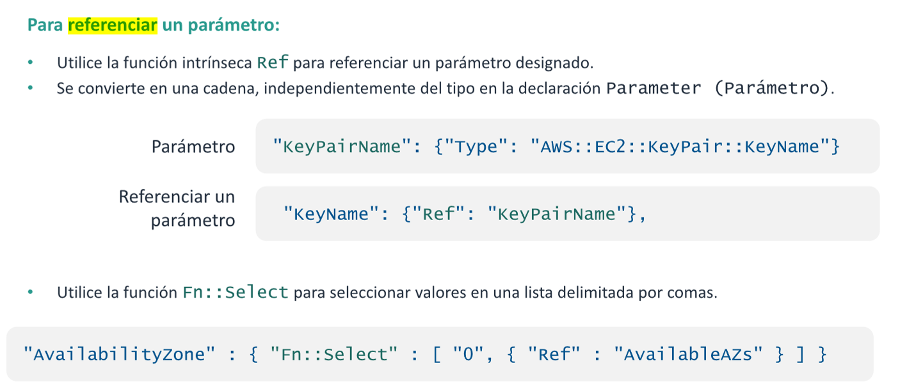
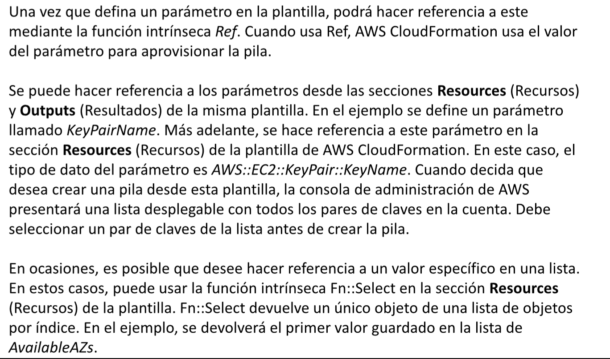

## Ref y otras funciones intrinsecas

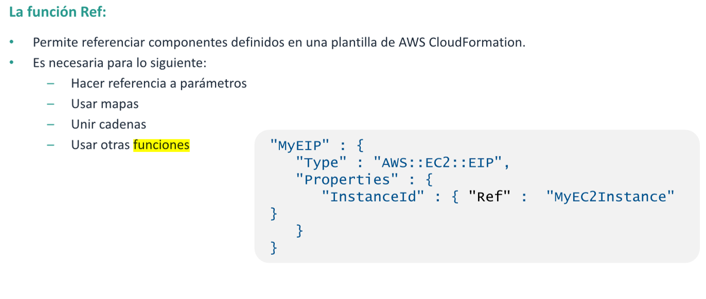

Podría hacer una pregunta con frecuencia cuando escriba plantillas: ¿Cómo se hace
referencia a un elemento de una plantilla desde otro elemento? Por ejemplo, ¿cómo se
asocia una instancia EC2 con una dirección IP elástica definida en la misma plantilla?
En el ejemplo, se puede ver el uso de la función intrínseca más común, Ref, en un
fragmento de código de AWS CloudFormation que define una dirección IP elástica.
Cuando se usa la función Ref, se puede hacer referencia a una instancia EC2 definida
dentro de la plantilla en sí, 10 que establece una cadena de relaciones entre sus
recursos. Se puede usar un patrón similar para asociar grupos de seguridad con
recursos, tablas de direccionamiento con rutas e instancias EC2 con subredes.
Tenga cuidado al utilizar la función Ref. EI valor devuelto por Ref depende del recurso
que se le proporcione. Por ejemplo, si se usa la función Ref en un S3 Bucket, se
devuelve el nombre del bucket, pero si se la usa en una cola de Amazon Simple Queue
Service (Amazon SQS), se devuelve la URL de cola. Asegúrese de que el recurso al que
haga referencia con la función Ref devuelva el identificador correcto en el contexto
actual. En el ejemplo, la función Ref devuelve el identificador de una instancia EC2, y
corresponde asignarlo a la propiedad Instanceld del objeto AWS::EC2::ElP.